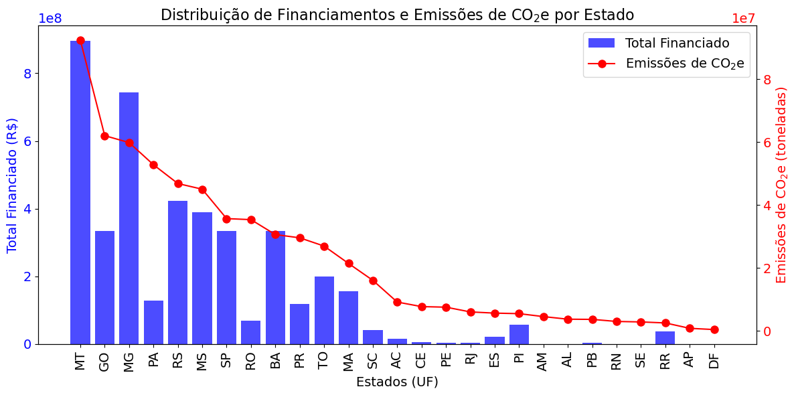
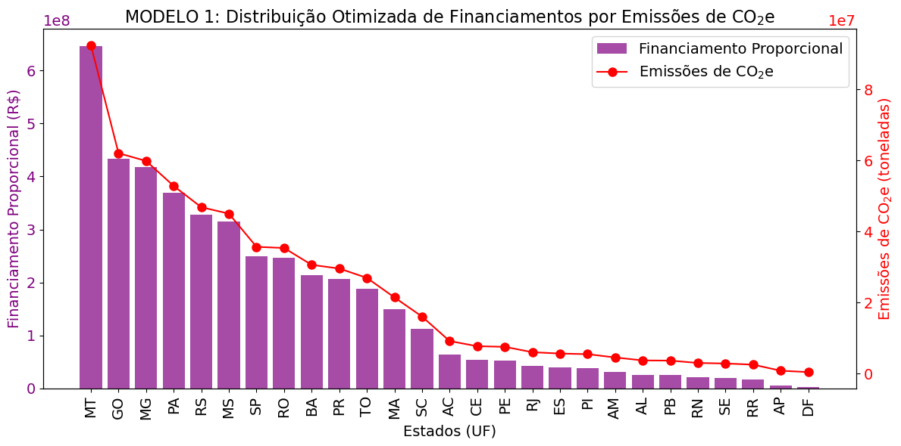
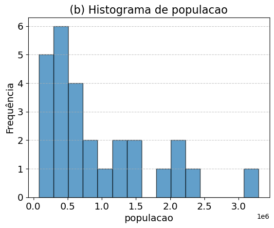
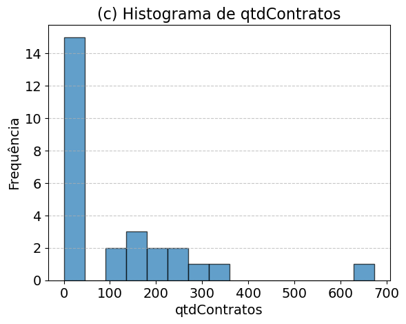
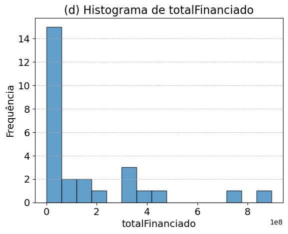
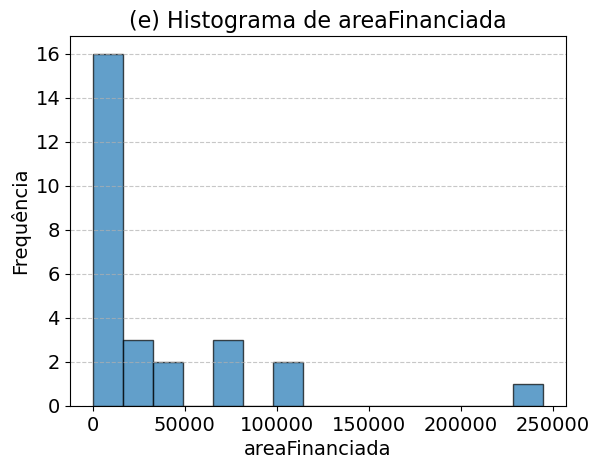
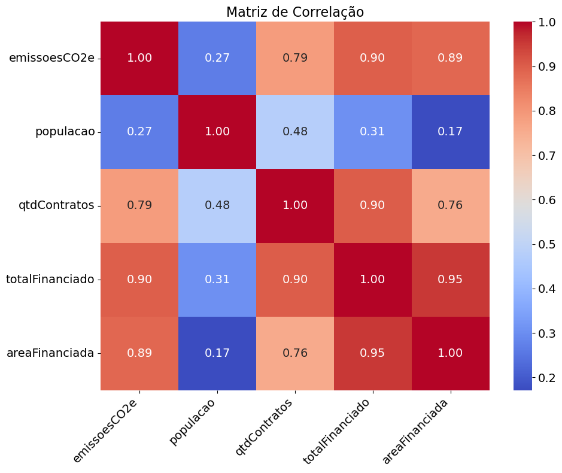

```python
# Imports
import numpy as np
import random
import seaborn as sns
from scipy.optimize import linprog
import pandas as pd
import matplotlib.pyplot as plt
import warnings
warnings.filterwarnings('ignore')
```


```python
# Definir a semente aleatória para reprodutibilidade
SEED = 42
random.seed(SEED)
np.random.seed(SEED)
```

## Carregando os Dados


```python
# Carregar o dataset
file_path = 'dataset.csv'
data = pd.read_csv(file_path)
```

## Dataset


```python
# Visualização do dataset completo
data
```


<div>
<style scoped>
    .dataframe tbody tr th:only-of-type {
        vertical-align: middle;
    }

    .dataframe tbody tr th {
        vertical-align: top;
    }

    .dataframe thead th {
        text-align: right;
    }
</style>
<table border="1" class="dataframe">
  <thead>
    <tr style="text-align: right;">
      <th></th>
      <th>UF</th>
      <th>emissoesCO2e</th>
      <th>populacao</th>
      <th>qtdContratos</th>
      <th>totalFinanciado</th>
      <th>areaFinanciada</th>
    </tr>
  </thead>
  <tbody>
    <tr>
      <th>0</th>
      <td>Mato Grosso</td>
      <td>9.245920e+07</td>
      <td>502120</td>
      <td>346.0</td>
      <td>8.958880e+08</td>
      <td>244768.85</td>
    </tr>
    <tr>
      <th>1</th>
      <td>Goiás</td>
      <td>6.207678e+07</td>
      <td>480391</td>
      <td>161.0</td>
      <td>3.347290e+08</td>
      <td>73834.96</td>
    </tr>
    <tr>
      <th>2</th>
      <td>Minas Gerais</td>
      <td>5.988115e+07</td>
      <td>2418095</td>
      <td>674.0</td>
      <td>7.433772e+08</td>
      <td>110545.68</td>
    </tr>
    <tr>
      <th>3</th>
      <td>Pará</td>
      <td>5.283352e+07</td>
      <td>2024601</td>
      <td>138.0</td>
      <td>1.274818e+08</td>
      <td>26470.31</td>
    </tr>
    <tr>
      <th>4</th>
      <td>Rio Grande do Sul</td>
      <td>4.685190e+07</td>
      <td>1359872</td>
      <td>208.0</td>
      <td>4.231343e+08</td>
      <td>81323.01</td>
    </tr>
    <tr>
      <th>5</th>
      <td>Mato Grosso do Sul</td>
      <td>4.504871e+07</td>
      <td>327142</td>
      <td>238.0</td>
      <td>3.884781e+08</td>
      <td>98017.03</td>
    </tr>
    <tr>
      <th>6</th>
      <td>São Paulo</td>
      <td>3.569799e+07</td>
      <td>1413339</td>
      <td>237.0</td>
      <td>3.345948e+08</td>
      <td>34015.51</td>
    </tr>
    <tr>
      <th>7</th>
      <td>Rondônia</td>
      <td>3.536855e+07</td>
      <td>339524</td>
      <td>98.0</td>
      <td>6.830295e+07</td>
      <td>12936.81</td>
    </tr>
    <tr>
      <th>8</th>
      <td>Bahia</td>
      <td>3.061675e+07</td>
      <td>3291488</td>
      <td>271.0</td>
      <td>3.347613e+08</td>
      <td>69763.15</td>
    </tr>
    <tr>
      <th>9</th>
      <td>Paraná</td>
      <td>2.958475e+07</td>
      <td>1264533</td>
      <td>131.0</td>
      <td>1.186747e+08</td>
      <td>18660.80</td>
    </tr>
    <tr>
      <th>10</th>
      <td>Tocantins</td>
      <td>2.695739e+07</td>
      <td>258653</td>
      <td>190.0</td>
      <td>2.004184e+08</td>
      <td>43268.45</td>
    </tr>
    <tr>
      <th>11</th>
      <td>Maranhão</td>
      <td>2.144803e+07</td>
      <td>1969709</td>
      <td>135.0</td>
      <td>1.564745e+08</td>
      <td>32320.16</td>
    </tr>
    <tr>
      <th>12</th>
      <td>Santa Catarina</td>
      <td>1.605524e+07</td>
      <td>886089</td>
      <td>22.0</td>
      <td>4.216417e+07</td>
      <td>7194.12</td>
    </tr>
    <tr>
      <th>13</th>
      <td>Acre</td>
      <td>9.154466e+06</td>
      <td>212076</td>
      <td>29.0</td>
      <td>1.469654e+07</td>
      <td>2191.24</td>
    </tr>
    <tr>
      <th>14</th>
      <td>Ceará</td>
      <td>7.706531e+06</td>
      <td>2032839</td>
      <td>1.0</td>
      <td>4.995296e+06</td>
      <td>684.32</td>
    </tr>
    <tr>
      <th>15</th>
      <td>Pernambuco</td>
      <td>7.526680e+06</td>
      <td>1459542</td>
      <td>32.0</td>
      <td>4.365060e+06</td>
      <td>868.87</td>
    </tr>
    <tr>
      <th>16</th>
      <td>Rio de Janeiro</td>
      <td>6.014757e+06</td>
      <td>336496</td>
      <td>20.0</td>
      <td>4.531549e+06</td>
      <td>655.51</td>
    </tr>
    <tr>
      <th>17</th>
      <td>Espírito Santo</td>
      <td>5.638192e+06</td>
      <td>540480</td>
      <td>33.0</td>
      <td>2.075268e+07</td>
      <td>1601.64</td>
    </tr>
    <tr>
      <th>18</th>
      <td>Piauí</td>
      <td>5.464085e+06</td>
      <td>999815</td>
      <td>28.0</td>
      <td>5.790975e+07</td>
      <td>11554.56</td>
    </tr>
    <tr>
      <th>19</th>
      <td>Amazonas</td>
      <td>4.530030e+06</td>
      <td>676639</td>
      <td>0.0</td>
      <td>0.000000e+00</td>
      <td>0.00</td>
    </tr>
    <tr>
      <th>20</th>
      <td>Alagoas</td>
      <td>3.702821e+06</td>
      <td>607762</td>
      <td>0.0</td>
      <td>0.000000e+00</td>
      <td>0.00</td>
    </tr>
    <tr>
      <th>21</th>
      <td>Paraíba</td>
      <td>3.645600e+06</td>
      <td>812220</td>
      <td>3.0</td>
      <td>3.299920e+06</td>
      <td>525.59</td>
    </tr>
    <tr>
      <th>22</th>
      <td>Rio Grande do Norte</td>
      <td>2.986279e+06</td>
      <td>595076</td>
      <td>0.0</td>
      <td>0.000000e+00</td>
      <td>0.00</td>
    </tr>
    <tr>
      <th>23</th>
      <td>Sergipe</td>
      <td>2.831921e+06</td>
      <td>443097</td>
      <td>0.0</td>
      <td>0.000000e+00</td>
      <td>0.00</td>
    </tr>
    <tr>
      <th>24</th>
      <td>Roraima</td>
      <td>2.511321e+06</td>
      <td>138937</td>
      <td>28.0</td>
      <td>3.799176e+07</td>
      <td>5318.11</td>
    </tr>
    <tr>
      <th>25</th>
      <td>Amapá</td>
      <td>7.978222e+05</td>
      <td>82505</td>
      <td>0.0</td>
      <td>0.000000e+00</td>
      <td>0.00</td>
    </tr>
    <tr>
      <th>26</th>
      <td>Distrito Federal</td>
      <td>4.103762e+05</td>
      <td>99299</td>
      <td>0.0</td>
      <td>0.000000e+00</td>
      <td>0.00</td>
    </tr>
  </tbody>
</table>
</div>


## Distribuição dos Financiamentos


```python
from matplotlib.ticker import ScalarFormatter

# Plotar a distribuição inicial de financiamentos e emissões
def plot_distribution(data):
    fig, ax1 = plt.subplots(figsize=(12, 6))

    # Dicionário de mapeamento de nomes para siglas
    siglas_estados = {
        'Acre': 'AC', 'Alagoas': 'AL', 'Amapá': 'AP', 'Amazonas': 'AM',
        'Bahia': 'BA', 'Ceará': 'CE', 'Distrito Federal': 'DF', 'Espírito Santo': 'ES',
        'Goiás': 'GO', 'Maranhão': 'MA', 'Mato Grosso': 'MT', 'Mato Grosso do Sul': 'MS',
        'Minas Gerais': 'MG', 'Pará': 'PA', 'Paraíba': 'PB', 'Paraná': 'PR',
        'Pernambuco': 'PE', 'Piauí': 'PI', 'Rio de Janeiro': 'RJ', 'Rio Grande do Norte': 'RN',
        'Rio Grande do Sul': 'RS', 'Rondônia': 'RO', 'Roraima': 'RR', 'Santa Catarina': 'SC',
        'São Paulo': 'SP', 'Sergipe': 'SE', 'Tocantins': 'TO'
    }

    # Criar lista temporária com as siglas dos estados
    uf_siglas = data['UF'].map(siglas_estados)

    # Gráfico de barras para 'totalFinanciado'
    ax1.bar(
        uf_siglas,
        data['totalFinanciado'],
        color='blue',
        alpha=0.7,
        label='Total Financiado'
    )
    ax1.set_xlabel('Estados (UF)', fontsize=14)
    ax1.set_ylabel('Total Financiado (R$)', color='blue', fontsize=14)
    ax1.tick_params(axis='y', labelcolor='blue', labelsize=14)
    ax1.set_title('Distribuição de Financiamentos e Emissões de CO$_2$e por Estado', fontsize=16)
    ax1.yaxis.set_major_formatter(ScalarFormatter())
    ax1.yaxis.get_offset_text().set_fontsize(14)

    # Gráfico de linha para 'emissoesCO2e'
    ax2 = ax1.twinx()
    ax2.plot(
        uf_siglas,
        data['emissoesCO2e'],
        color='red',
        marker='o',
        label='Emissões de CO$_2$e',
        markersize=8
    )
    ax2.set_ylabel('Emissões de CO$_2$e (toneladas)', color='red', fontsize=14)
    ax2.tick_params(axis='y', labelcolor='red', labelsize=14)
    ax2.yaxis.set_major_formatter(ScalarFormatter())
    ax2.yaxis.get_offset_text().set_fontsize(14)

    # Legendas
    fig.legend(
        loc='upper right',
        bbox_to_anchor=(1, 1),
        bbox_transform=ax1.transAxes,
        fontsize=14,
        title_fontsize=14,
        markerscale=1
    )

    # Rótulos do eixo X com siglas
    ax1.set_xticks(range(len(data['UF'])))
    ax1.set_xticklabels(uf_siglas, rotation=90, fontsize=14)

    plt.tight_layout()
    plt.show()
    
plot_distribution(data)
```


    

    


## Estatísticas Descritivas


```python
# Selecionando as variáveis de interesse
variables = ['emissoesCO2e', 'populacao', 'qtdContratos', 'totalFinanciado', 'areaFinanciada']
```


```python
# Criando histogramas para cada variável com títulos ordenados
import string

# Lista de letras para ordenação (a, b, c, ...)
letters = string.ascii_lowercase

# Criando histogramas para cada variável
for idx, var in enumerate(variables):
    plt.figure()
    plt.hist(data[var], bins=15, edgecolor='black', alpha=0.7)
    plt.title(f'({letters[idx]}) Histograma de {var}', fontsize=16)  # Título com referência ordenada
    plt.xlabel(var, fontsize=14)  # Ajustar o tamanho da fonte do rótulo do eixo X
    plt.ylabel('Frequência', fontsize=14)  # Ajustar o tamanho da fonte do rótulo do eixo Y
    plt.xticks(fontsize=14)  # Ajustar o tamanho da fonte dos ticks no eixo X
    plt.yticks(fontsize=14)  # Ajustar o tamanho da fonte dos ticks no eixo Y
    plt.grid(axis='y', linestyle='--', alpha=0.7)
    plt.show()
```


    

    


    

    


    

    


    

    


    

    


```python
# Calculando as estatísticas descritivas
descriptive_stats = data[variables].describe()

# Convertendo a linha "count" para números inteiros
descriptive_stats.loc['count'] = descriptive_stats.loc['count'].astype(int)

# Formatando as demais linhas para uma casa decimal
descriptive_stats = descriptive_stats.applymap(lambda x: f"{x:.1f}" if isinstance(x, (float, int)) else x)

# Exibindo o resultado formatado
descriptive_stats
```


<div>
<style scoped>
    .dataframe tbody tr th:only-of-type {
        vertical-align: middle;
    }

    .dataframe tbody tr th {
        vertical-align: top;
    }

    .dataframe thead th {
        text-align: right;
    }
</style>
<table border="1" class="dataframe">
  <thead>
    <tr style="text-align: right;">
      <th></th>
      <th>emissoesCO2e</th>
      <th>populacao</th>
      <th>qtdContratos</th>
      <th>totalFinanciado</th>
      <th>areaFinanciada</th>
    </tr>
  </thead>
  <tbody>
    <tr>
      <th>count</th>
      <td>27.0</td>
      <td>27.0</td>
      <td>27.0</td>
      <td>27.0</td>
      <td>27.0</td>
    </tr>
    <tr>
      <th>mean</th>
      <td>22881512.6</td>
      <td>947123.7</td>
      <td>112.0</td>
      <td>159889698.4</td>
      <td>32463.7</td>
    </tr>
    <tr>
      <th>std</th>
      <td>24034659.1</td>
      <td>814029.3</td>
      <td>151.5</td>
      <td>235171553.4</td>
      <td>53969.1</td>
    </tr>
    <tr>
      <th>min</th>
      <td>410376.2</td>
      <td>82505.0</td>
      <td>0.0</td>
      <td>0.0</td>
      <td>0.0</td>
    </tr>
    <tr>
      <th>25%</th>
      <td>4116425.6</td>
      <td>338010.0</td>
      <td>2.0</td>
      <td>3832489.8</td>
      <td>590.5</td>
    </tr>
    <tr>
      <th>50%</th>
      <td>9154465.7</td>
      <td>607762.0</td>
      <td>32.0</td>
      <td>42164172.6</td>
      <td>7194.1</td>
    </tr>
    <tr>
      <th>75%</th>
      <td>35533273.7</td>
      <td>1386605.5</td>
      <td>175.5</td>
      <td>267506631.2</td>
      <td>38642.0</td>
    </tr>
    <tr>
      <th>max</th>
      <td>92459204.1</td>
      <td>3291488.0</td>
      <td>674.0</td>
      <td>895888012.2</td>
      <td>244768.9</td>
    </tr>
  </tbody>
</table>
</div>


## Análise de Correlação


```python
# Selecionar as variáveis numéricas para análise de correlação
numeric_cols = data.select_dtypes(include=[np.number])
```


```python
# Calcular a matriz de correlação
correlation_matrix = numeric_cols.corr()
```


```python
# Gerar o gráfico de correlação
plt.figure(figsize=(10, 8))
heatmap = sns.heatmap(
    correlation_matrix, 
    annot=True, 
    cmap='coolwarm', 
    fmt='.2f', 
    cbar=True, 
    annot_kws={"fontsize": 14}  # Tamanho da fonte dos valores dentro das células
)
plt.title('Matriz de Correlação', fontsize=16)  # Ajustar o tamanho da fonte do título
plt.xticks(rotation=45, ha='right', fontsize=14)  # Ajustar o tamanho da fonte e rotação dos rótulos do eixo X
plt.yticks(rotation=0, fontsize=14)  # Ajustar o tamanho da fonte dos rótulos do eixo Y

# Ajustar a fonte da barra lateral (colorbar)
colorbar = heatmap.collections[0].colorbar
colorbar.ax.yaxis.label.set_size(14)  # Tamanho da fonte do rótulo
colorbar.ax.tick_params(labelsize=14)  # Tamanho da fonte dos ticks da barra lateral

plt.tight_layout()
plt.show()
```


    

    


# Fim
