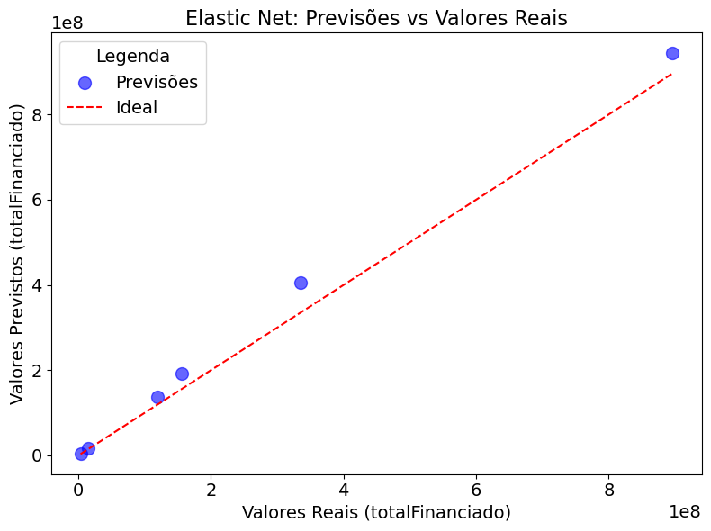

```python
# Imports
import numpy as np
import random
import seaborn as sns
from scipy.optimize import linprog
import pandas as pd
import matplotlib.pyplot as plt
import warnings
warnings.filterwarnings('ignore')
```


```python
# Definir a semente aleatória para reprodutibilidade
SEED = 42
random.seed(SEED)
np.random.seed(SEED)
```

## Carregando os Dados


```python
# Carregar o dataset
file_path = 'dataset.csv'
data = pd.read_csv(file_path)
```

## Análise de Regressão


```python
# Imports
from sklearn.model_selection import train_test_split, GridSearchCV
from sklearn.linear_model import ElasticNet
from sklearn.metrics import mean_squared_error, r2_score
```


```python
# Selecionar as variáveis para a regressão
X = data[['emissoesCO2e', 'populacao', 'qtdContratos', 'areaFinanciada']]  # Variáveis preditoras
y = data['totalFinanciado']  # Variável target
```


```python
from sklearn.preprocessing import StandardScaler

# Normalizar os dados
scaler = StandardScaler()
X_scaled = scaler.fit_transform(X)
```


```python
# Dividir os dados em treino e teste
X_train, X_test, y_train, y_test = train_test_split(X_scaled, y, test_size=0.2, random_state=42)
```


```python
# Definir o modelo Elastic Net com busca de hiperparâmetros
param_grid = {
    'alpha': [0.01, 0.1, 1, 10],  # Parâmetro de regularização
    'l1_ratio': [0.2, 0.5, 0.7, 1.0]  # Peso entre Lasso e Ridge
}

elastic_net = ElasticNet(random_state=42, max_iter=10000)
grid_search = GridSearchCV(estimator=elastic_net, param_grid=param_grid, scoring='r2', cv=5)
grid_search.fit(X_train, y_train)
```


<style>#sk-container-id-1 {color: black;background-color: white;}#sk-container-id-1 pre{padding: 0;}#sk-container-id-1 div.sk-toggleable {background-color: white;}#sk-container-id-1 label.sk-toggleable__label {cursor: pointer;display: block;width: 100%;margin-bottom: 0;padding: 0.3em;box-sizing: border-box;text-align: center;}#sk-container-id-1 label.sk-toggleable__label-arrow:before {content: "▸";float: left;margin-right: 0.25em;color: #696969;}#sk-container-id-1 label.sk-toggleable__label-arrow:hover:before {color: black;}#sk-container-id-1 div.sk-estimator:hover label.sk-toggleable__label-arrow:before {color: black;}#sk-container-id-1 div.sk-toggleable__content {max-height: 0;max-width: 0;overflow: hidden;text-align: left;background-color: #f0f8ff;}#sk-container-id-1 div.sk-toggleable__content pre {margin: 0.2em;color: black;border-radius: 0.25em;background-color: #f0f8ff;}#sk-container-id-1 input.sk-toggleable__control:checked~div.sk-toggleable__content {max-height: 200px;max-width: 100%;overflow: auto;}#sk-container-id-1 input.sk-toggleable__control:checked~label.sk-toggleable__label-arrow:before {content: "▾";}#sk-container-id-1 div.sk-estimator input.sk-toggleable__control:checked~label.sk-toggleable__label {background-color: #d4ebff;}#sk-container-id-1 div.sk-label input.sk-toggleable__control:checked~label.sk-toggleable__label {background-color: #d4ebff;}#sk-container-id-1 input.sk-hidden--visually {border: 0;clip: rect(1px 1px 1px 1px);clip: rect(1px, 1px, 1px, 1px);height: 1px;margin: -1px;overflow: hidden;padding: 0;position: absolute;width: 1px;}#sk-container-id-1 div.sk-estimator {font-family: monospace;background-color: #f0f8ff;border: 1px dotted black;border-radius: 0.25em;box-sizing: border-box;margin-bottom: 0.5em;}#sk-container-id-1 div.sk-estimator:hover {background-color: #d4ebff;}#sk-container-id-1 div.sk-parallel-item::after {content: "";width: 100%;border-bottom: 1px solid gray;flex-grow: 1;}#sk-container-id-1 div.sk-label:hover label.sk-toggleable__label {background-color: #d4ebff;}#sk-container-id-1 div.sk-serial::before {content: "";position: absolute;border-left: 1px solid gray;box-sizing: border-box;top: 0;bottom: 0;left: 50%;z-index: 0;}#sk-container-id-1 div.sk-serial {display: flex;flex-direction: column;align-items: center;background-color: white;padding-right: 0.2em;padding-left: 0.2em;position: relative;}#sk-container-id-1 div.sk-item {position: relative;z-index: 1;}#sk-container-id-1 div.sk-parallel {display: flex;align-items: stretch;justify-content: center;background-color: white;position: relative;}#sk-container-id-1 div.sk-item::before, #sk-container-id-1 div.sk-parallel-item::before {content: "";position: absolute;border-left: 1px solid gray;box-sizing: border-box;top: 0;bottom: 0;left: 50%;z-index: -1;}#sk-container-id-1 div.sk-parallel-item {display: flex;flex-direction: column;z-index: 1;position: relative;background-color: white;}#sk-container-id-1 div.sk-parallel-item:first-child::after {align-self: flex-end;width: 50%;}#sk-container-id-1 div.sk-parallel-item:last-child::after {align-self: flex-start;width: 50%;}#sk-container-id-1 div.sk-parallel-item:only-child::after {width: 0;}#sk-container-id-1 div.sk-dashed-wrapped {border: 1px dashed gray;margin: 0 0.4em 0.5em 0.4em;box-sizing: border-box;padding-bottom: 0.4em;background-color: white;}#sk-container-id-1 div.sk-label label {font-family: monospace;font-weight: bold;display: inline-block;line-height: 1.2em;}#sk-container-id-1 div.sk-label-container {text-align: center;}#sk-container-id-1 div.sk-container {/* jupyter's `normalize.less` sets `[hidden] { display: none; }` but bootstrap.min.css set `[hidden] { display: none !important; }` so we also need the `!important` here to be able to override the default hidden behavior on the sphinx rendered scikit-learn.org. See: https://github.com/scikit-learn/scikit-learn/issues/21755 */display: inline-block !important;position: relative;}#sk-container-id-1 div.sk-text-repr-fallback {display: none;}</style><div id="sk-container-id-1" class="sk-top-container"><div class="sk-text-repr-fallback"><pre>GridSearchCV(cv=5, estimator=ElasticNet(max_iter=10000, random_state=42),
             param_grid={&#x27;alpha&#x27;: [0.01, 0.1, 1, 10],
                         &#x27;l1_ratio&#x27;: [0.2, 0.5, 0.7, 1.0]},
             scoring=&#x27;r2&#x27;)</pre><b>In a Jupyter environment, please rerun this cell to show the HTML representation or trust the notebook. <br />On GitHub, the HTML representation is unable to render, please try loading this page with nbviewer.org.</b></div><div class="sk-container" hidden><div class="sk-item sk-dashed-wrapped"><div class="sk-label-container"><div class="sk-label sk-toggleable"><input class="sk-toggleable__control sk-hidden--visually" id="sk-estimator-id-1" type="checkbox" ><label for="sk-estimator-id-1" class="sk-toggleable__label sk-toggleable__label-arrow">GridSearchCV</label><div class="sk-toggleable__content"><pre>GridSearchCV(cv=5, estimator=ElasticNet(max_iter=10000, random_state=42),
             param_grid={&#x27;alpha&#x27;: [0.01, 0.1, 1, 10],
                         &#x27;l1_ratio&#x27;: [0.2, 0.5, 0.7, 1.0]},
             scoring=&#x27;r2&#x27;)</pre></div></div></div><div class="sk-parallel"><div class="sk-parallel-item"><div class="sk-item"><div class="sk-label-container"><div class="sk-label sk-toggleable"><input class="sk-toggleable__control sk-hidden--visually" id="sk-estimator-id-2" type="checkbox" ><label for="sk-estimator-id-2" class="sk-toggleable__label sk-toggleable__label-arrow">estimator: ElasticNet</label><div class="sk-toggleable__content"><pre>ElasticNet(max_iter=10000, random_state=42)</pre></div></div></div><div class="sk-serial"><div class="sk-item"><div class="sk-estimator sk-toggleable"><input class="sk-toggleable__control sk-hidden--visually" id="sk-estimator-id-3" type="checkbox" ><label for="sk-estimator-id-3" class="sk-toggleable__label sk-toggleable__label-arrow">ElasticNet</label><div class="sk-toggleable__content"><pre>ElasticNet(max_iter=10000, random_state=42)</pre></div></div></div></div></div></div></div></div></div></div>


```python
# Melhor modelo encontrado
best_model = grid_search.best_estimator_
```


```python
# Fazer previsões
y_pred_train = best_model.predict(X_train)
y_pred_test = best_model.predict(X_test)
```


```python
# Avaliar o modelo
print("Melhores Parâmetros:", grid_search.best_params_)
print("R² (Treino):", r2_score(y_train, y_pred_train))
print("R² (Teste):", r2_score(y_test, y_pred_test))
print("RMSE (Teste):", np.sqrt(mean_squared_error(y_test, y_pred_test)))
```

    Melhores Parâmetros: {'alpha': 0.01, 'l1_ratio': 1.0}
    R² (Treino): 0.9788011751878921
    R² (Teste): 0.9842670169660397
    RMSE (Teste): 38541048.50533447
    


```python
from matplotlib.ticker import ScalarFormatter

# Visualizar as previsões x valores reais
plt.figure(figsize=(8, 6))

# Ajustar o tamanho dos pontos no gráfico
plt.scatter(y_test, y_pred_test, color='blue', alpha=0.6, label='Previsões', s=100)  # Tamanho dos pontos ajustado

# Linha ideal
plt.plot(
    [min(y_test), max(y_test)], 
    [min(y_test), max(y_test)], 
    color='red', linestyle='--', label='Ideal'
)

# Ajustar rótulos dos eixos
plt.xlabel('Valores Reais (totalFinanciado)', fontsize=14)  # Tamanho da fonte do eixo X
plt.ylabel('Valores Previstos (totalFinanciado)', fontsize=14)  # Tamanho da fonte do eixo Y

# Ajustar título
plt.title('Elastic Net: Previsões vs Valores Reais', fontsize=16)  # Tamanho da fonte do título

# Ajustar legenda
plt.legend(
    fontsize=14,  # Tamanho da fonte da legenda
    title='Legenda', 
    title_fontsize=14, 
    scatterpoints=1,  # Número de pontos exibidos na legenda
    markerscale=1  # Tamanho dos pontos na legenda em relação ao gráfico
)

# Ajustar ticks dos eixos
plt.xticks(fontsize=14)  # Tamanho da fonte dos ticks do eixo X
plt.yticks(fontsize=14)  # Tamanho da fonte dos ticks do eixo Y

# Ajustar as ordens de grandeza nos eixos
ax = plt.gca()
ax.xaxis.set_major_formatter(ScalarFormatter())
ax.xaxis.get_offset_text().set_fontsize(14)  # Tamanho da fonte das ordens de grandeza no eixo X
ax.yaxis.set_major_formatter(ScalarFormatter())
ax.yaxis.get_offset_text().set_fontsize(14)  # Tamanho da fonte das ordens de grandeza no eixo Y

plt.tight_layout()
plt.show()
```


    

    


# Fim
