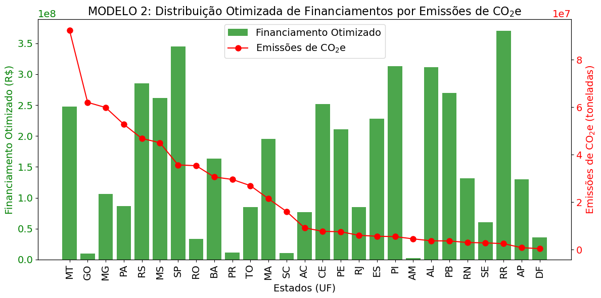
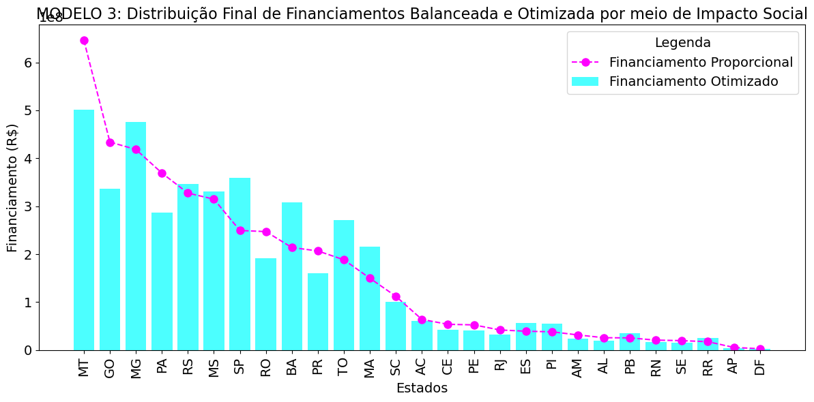
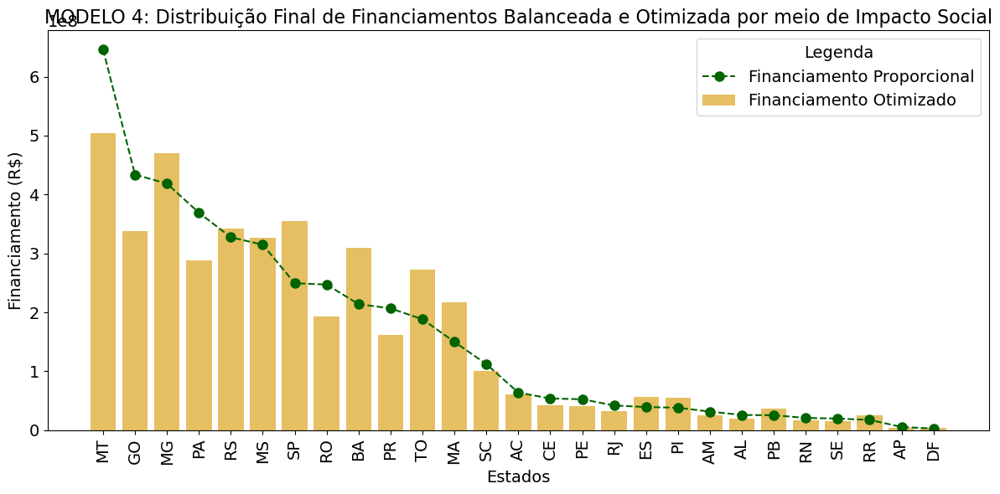

```python
# Imports
import numpy as np
import random
import seaborn as sns
from scipy.optimize import linprog
import pandas as pd
import matplotlib.pyplot as plt
import warnings
warnings.filterwarnings('ignore')
```


```python
# Definir a semente aleatória para reprodutibilidade
SEED = 42
random.seed(SEED)
np.random.seed(SEED)
```

## Carregando os Dados


```python
# Carregar o dataset
file_path = 'dataset.csv'
data = pd.read_csv(file_path)
```

## Modelo 1: Redistribuição de recuros financeiros baseada nas Emissões de CO2e


```python
# Variáveis iniciais
states = data['UF']
emissions = data['emissoesCO2e'].values
financing = data['totalFinanciado'].values
```


```python
# Soma total de financiamento disponível
total_financing = financing.sum()
```


```python
# Distribuir o financiamento proporcionalmente às emissões de CO2e
proportional_financing = (emissions / emissions.sum()) * total_financing
```


```python
# Adicionar os resultados ao DataFrame
data['FinalFinancing_M1'] = proportional_financing
```


```python
# Exibir os resultados otimizados
data
```


<div>
<style scoped>
    .dataframe tbody tr th:only-of-type {
        vertical-align: middle;
    }

    .dataframe tbody tr th {
        vertical-align: top;
    }

    .dataframe thead th {
        text-align: right;
    }
</style>
<table border="1" class="dataframe">
  <thead>
    <tr style="text-align: right;">
      <th></th>
      <th>UF</th>
      <th>emissoesCO2e</th>
      <th>populacao</th>
      <th>qtdContratos</th>
      <th>totalFinanciado</th>
      <th>areaFinanciada</th>
      <th>FinalFinancing_M1</th>
    </tr>
  </thead>
  <tbody>
    <tr>
      <th>0</th>
      <td>Mato Grosso</td>
      <td>9.245920e+07</td>
      <td>502120</td>
      <td>346.0</td>
      <td>8.958880e+08</td>
      <td>244768.85</td>
      <td>6.460794e+08</td>
    </tr>
    <tr>
      <th>1</th>
      <td>Goiás</td>
      <td>6.207678e+07</td>
      <td>480391</td>
      <td>161.0</td>
      <td>3.347290e+08</td>
      <td>73834.96</td>
      <td>4.337754e+08</td>
    </tr>
    <tr>
      <th>2</th>
      <td>Minas Gerais</td>
      <td>5.988115e+07</td>
      <td>2418095</td>
      <td>674.0</td>
      <td>7.433772e+08</td>
      <td>110545.68</td>
      <td>4.184329e+08</td>
    </tr>
    <tr>
      <th>3</th>
      <td>Pará</td>
      <td>5.283352e+07</td>
      <td>2024601</td>
      <td>138.0</td>
      <td>1.274818e+08</td>
      <td>26470.31</td>
      <td>3.691860e+08</td>
    </tr>
    <tr>
      <th>4</th>
      <td>Rio Grande do Sul</td>
      <td>4.685190e+07</td>
      <td>1359872</td>
      <td>208.0</td>
      <td>4.231343e+08</td>
      <td>81323.01</td>
      <td>3.273882e+08</td>
    </tr>
    <tr>
      <th>5</th>
      <td>Mato Grosso do Sul</td>
      <td>4.504871e+07</td>
      <td>327142</td>
      <td>238.0</td>
      <td>3.884781e+08</td>
      <td>98017.03</td>
      <td>3.147880e+08</td>
    </tr>
    <tr>
      <th>6</th>
      <td>São Paulo</td>
      <td>3.569799e+07</td>
      <td>1413339</td>
      <td>237.0</td>
      <td>3.345948e+08</td>
      <td>34015.51</td>
      <td>2.494477e+08</td>
    </tr>
    <tr>
      <th>7</th>
      <td>Rondônia</td>
      <td>3.536855e+07</td>
      <td>339524</td>
      <td>98.0</td>
      <td>6.830295e+07</td>
      <td>12936.81</td>
      <td>2.471457e+08</td>
    </tr>
    <tr>
      <th>8</th>
      <td>Bahia</td>
      <td>3.061675e+07</td>
      <td>3291488</td>
      <td>271.0</td>
      <td>3.347613e+08</td>
      <td>69763.15</td>
      <td>2.139414e+08</td>
    </tr>
    <tr>
      <th>9</th>
      <td>Paraná</td>
      <td>2.958475e+07</td>
      <td>1264533</td>
      <td>131.0</td>
      <td>1.186747e+08</td>
      <td>18660.80</td>
      <td>2.067300e+08</td>
    </tr>
    <tr>
      <th>10</th>
      <td>Tocantins</td>
      <td>2.695739e+07</td>
      <td>258653</td>
      <td>190.0</td>
      <td>2.004184e+08</td>
      <td>43268.45</td>
      <td>1.883708e+08</td>
    </tr>
    <tr>
      <th>11</th>
      <td>Maranhão</td>
      <td>2.144803e+07</td>
      <td>1969709</td>
      <td>135.0</td>
      <td>1.564745e+08</td>
      <td>32320.16</td>
      <td>1.498729e+08</td>
    </tr>
    <tr>
      <th>12</th>
      <td>Santa Catarina</td>
      <td>1.605524e+07</td>
      <td>886089</td>
      <td>22.0</td>
      <td>4.216417e+07</td>
      <td>7194.12</td>
      <td>1.121896e+08</td>
    </tr>
    <tr>
      <th>13</th>
      <td>Acre</td>
      <td>9.154466e+06</td>
      <td>212076</td>
      <td>29.0</td>
      <td>1.469654e+07</td>
      <td>2191.24</td>
      <td>6.396888e+07</td>
    </tr>
    <tr>
      <th>14</th>
      <td>Ceará</td>
      <td>7.706531e+06</td>
      <td>2032839</td>
      <td>1.0</td>
      <td>4.995296e+06</td>
      <td>684.32</td>
      <td>5.385111e+07</td>
    </tr>
    <tr>
      <th>15</th>
      <td>Pernambuco</td>
      <td>7.526680e+06</td>
      <td>1459542</td>
      <td>32.0</td>
      <td>4.365060e+06</td>
      <td>868.87</td>
      <td>5.259436e+07</td>
    </tr>
    <tr>
      <th>16</th>
      <td>Rio de Janeiro</td>
      <td>6.014757e+06</td>
      <td>336496</td>
      <td>20.0</td>
      <td>4.531549e+06</td>
      <td>655.51</td>
      <td>4.202947e+07</td>
    </tr>
    <tr>
      <th>17</th>
      <td>Espírito Santo</td>
      <td>5.638192e+06</td>
      <td>540480</td>
      <td>33.0</td>
      <td>2.075268e+07</td>
      <td>1601.64</td>
      <td>3.939813e+07</td>
    </tr>
    <tr>
      <th>18</th>
      <td>Piauí</td>
      <td>5.464085e+06</td>
      <td>999815</td>
      <td>28.0</td>
      <td>5.790975e+07</td>
      <td>11554.56</td>
      <td>3.818152e+07</td>
    </tr>
    <tr>
      <th>19</th>
      <td>Amazonas</td>
      <td>4.530030e+06</td>
      <td>676639</td>
      <td>0.0</td>
      <td>0.000000e+00</td>
      <td>0.00</td>
      <td>3.165460e+07</td>
    </tr>
    <tr>
      <th>20</th>
      <td>Alagoas</td>
      <td>3.702821e+06</td>
      <td>607762</td>
      <td>0.0</td>
      <td>0.000000e+00</td>
      <td>0.00</td>
      <td>2.587429e+07</td>
    </tr>
    <tr>
      <th>21</th>
      <td>Paraíba</td>
      <td>3.645600e+06</td>
      <td>812220</td>
      <td>3.0</td>
      <td>3.299920e+06</td>
      <td>525.59</td>
      <td>2.547445e+07</td>
    </tr>
    <tr>
      <th>22</th>
      <td>Rio Grande do Norte</td>
      <td>2.986279e+06</td>
      <td>595076</td>
      <td>0.0</td>
      <td>0.000000e+00</td>
      <td>0.00</td>
      <td>2.086729e+07</td>
    </tr>
    <tr>
      <th>23</th>
      <td>Sergipe</td>
      <td>2.831921e+06</td>
      <td>443097</td>
      <td>0.0</td>
      <td>0.000000e+00</td>
      <td>0.00</td>
      <td>1.978868e+07</td>
    </tr>
    <tr>
      <th>24</th>
      <td>Roraima</td>
      <td>2.511321e+06</td>
      <td>138937</td>
      <td>28.0</td>
      <td>3.799176e+07</td>
      <td>5318.11</td>
      <td>1.754842e+07</td>
    </tr>
    <tr>
      <th>25</th>
      <td>Amapá</td>
      <td>7.978222e+05</td>
      <td>82505</td>
      <td>0.0</td>
      <td>0.000000e+00</td>
      <td>0.00</td>
      <td>5.574962e+06</td>
    </tr>
    <tr>
      <th>26</th>
      <td>Distrito Federal</td>
      <td>4.103762e+05</td>
      <td>99299</td>
      <td>0.0</td>
      <td>0.000000e+00</td>
      <td>0.00</td>
      <td>2.867596e+06</td>
    </tr>
  </tbody>
</table>
</div>


```python
from matplotlib.ticker import ScalarFormatter

# Visualizar a distribuição proporcional
def plot_proportional_distribution(data):
    fig, ax1 = plt.subplots(figsize=(12, 6))

    # Dicionário de mapeamento de nomes para siglas
    siglas_estados = {
        'Acre': 'AC', 'Alagoas': 'AL', 'Amapá': 'AP', 'Amazonas': 'AM',
        'Bahia': 'BA', 'Ceará': 'CE', 'Distrito Federal': 'DF', 'Espírito Santo': 'ES',
        'Goiás': 'GO', 'Maranhão': 'MA', 'Mato Grosso': 'MT', 'Mato Grosso do Sul': 'MS',
        'Minas Gerais': 'MG', 'Pará': 'PA', 'Paraíba': 'PB', 'Paraná': 'PR',
        'Pernambuco': 'PE', 'Piauí': 'PI', 'Rio de Janeiro': 'RJ', 'Rio Grande do Norte': 'RN',
        'Rio Grande do Sul': 'RS', 'Rondônia': 'RO', 'Roraima': 'RR', 'Santa Catarina': 'SC',
        'São Paulo': 'SP', 'Sergipe': 'SE', 'Tocantins': 'TO'
    }

    # Criar lista temporária com as siglas dos estados
    uf_siglas = data['UF'].map(siglas_estados)
    
    # Gráfico de barras para 'ProportionalFinancing'
    ax1.bar(
        data['UF'], 
        data['FinalFinancing_M1'], 
        color='purple', 
        alpha=0.7, 
        label='Financiamento Proporcional'
    )
    ax1.set_xlabel('Estados (UF)', fontsize=14)  # Ajustar o tamanho da fonte do eixo X
    ax1.set_ylabel('Financiamento Proporcional (R$)', color='purple', fontsize=14)  # Ajustar o tamanho da fonte do eixo Y
    ax1.tick_params(axis='y', labelcolor='purple', labelsize=14)  # Ajustar o tamanho dos ticks do eixo Y
    ax1.set_title(
        'MODELO 1: Distribuição Otimizada de Financiamentos por Emissões de CO$_2$e', 
        fontsize=16
    )  # Ajustar o tamanho da fonte do título

    # Ajustar as ordens de grandeza no eixo Y1
    ax1.yaxis.set_major_formatter(ScalarFormatter())
    ax1.yaxis.get_offset_text().set_fontsize(14)

    # Gráfico de linha para 'emissoesCO2e'
    ax2 = ax1.twinx()
    ax2.plot(
        data['UF'], 
        data['emissoesCO2e'], 
        color='red', 
        marker='o', 
        label='Emissões de CO$_2$e', 
        markersize=8  # Tamanho dos marcadores no gráfico
    )
    ax2.set_ylabel('Emissões de CO$_2$e (toneladas)', color='red', fontsize=14)  # Ajustar o tamanho da fonte do eixo Y2
    ax2.tick_params(axis='y', labelcolor='red', labelsize=14)  # Ajustar o tamanho dos ticks do eixo Y2

    # Ajustar as ordens de grandeza no eixo Y2
    ax2.yaxis.set_major_formatter(ScalarFormatter())
    ax2.yaxis.get_offset_text().set_fontsize(14)

    # Legendas
    fig.legend(
        loc='upper right', 
        bbox_to_anchor=(1, 1), 
        bbox_transform=ax1.transAxes, 
        fontsize=14,  # Tamanho da fonte das legendas
        title_fontsize=14,  # Tamanho da fonte do título da legenda
        markerscale=1  # Escala dos marcadores na legenda
    )

    # Configurar os rótulos do eixo X com rotação vertical
    ax1.set_xticks(range(len(data['UF'])))
    ax1.set_xticklabels(uf_siglas, rotation=90, fontsize=14)  # Ajustar o tamanho da fonte dos rótulos do eixo X

    plt.tight_layout()
    plt.show()

plot_proportional_distribution(data)
```


    

    


## Modelo 2: Redistribuição de recuros financeiros baseada na Otimização Multiobjetivo (algoritmo NSGA-II)


```python
from deap import base, creator, tools, algorithms
```


```python
# Variáveis do problema
emissoes = data['emissoesCO2e'].values
populacao_rural = data['populacao'].values
total_financiado = data['totalFinanciado'].values
total_recursos = np.sum(total_financiado)
n_states = len(total_financiado)
```


```python
# Normalização Min-Max das variáveis
emissoes_min, emissoes_max = np.min(emissoes), np.max(emissoes)
populacao_rural_min, populacao_rural_max = np.min(populacao_rural), np.max(populacao_rural)

def normalize(value, vmin, vmax):
    return (value - vmin) / (vmax - vmin)

emissoes_norm = normalize(emissoes, emissoes_min, emissoes_max)
populacao_rural_norm = normalize(populacao_rural, populacao_rural_min, populacao_rural_max)
```


```python
# Definir o problema de otimização multi-objetivo com DEAP
creator.create("FitnessMulti", base.Fitness, weights=(-1.0, -1.0))  # Minimizar ambos os objetivos
creator.create("Individual", list, fitness=creator.FitnessMulti)

toolbox = base.Toolbox()
```


```python
# Inicialização dos indivíduos: valores de financiamento entre 0 e o total permitido
toolbox.register("attr_float", random.uniform, 0, max(total_financiado))
toolbox.register("individual", tools.initRepeat, creator.Individual, toolbox.attr_float, n=n_states)
toolbox.register("population", tools.initRepeat, list, toolbox.individual)
```


```python
# Função de avaliação
def evaluate(individual):
    # Garantir que a soma total seja próxima ao orçamento total
    scaling_factor = total_recursos / sum(individual)
    scaled_individual = [x * scaling_factor for x in individual]
    
    # Objetivo 1: Minimizar emissões normalizadas
    f1 = sum((emissoes_norm / total_financiado) * scaled_individual)
    
    # Objetivo 2: Maximizar população normalizada (negativo para alinhamento)
    f2 = -sum((populacao_rural_norm / total_financiado) * scaled_individual)
    
    return f1, f2
```


```python
# Função de restrição: soma próxima ao orçamento total
def feasible(individual):
    return abs(sum(individual) - total_recursos) < 1e-3
```


```python
# Registrar a função de avaliação
toolbox.register("evaluate", evaluate)
```


```python
# Decorar a função de avaliação com a penalização
toolbox.decorate("evaluate", tools.DeltaPenalty(feasible, 1e6))
```


```python
# Operadores genéticos
toolbox.register("mate", tools.cxBlend, alpha=0.5)
toolbox.register("mutate", tools.mutPolynomialBounded, low=0, up=max(total_financiado), eta=20, indpb=0.2)
toolbox.register("select", tools.selNSGA2)
toolbox.register("evaluate", evaluate)
```


```python
# Parâmetros do algoritmo
population_size = 100
generations = 100
mutation_prob = 0.2
crossover_prob = 0.7
```


```python
# Inicializar a população
population = toolbox.population(n=population_size)
```


```python
# Aplicar NSGA-II
algorithms.eaMuPlusLambda(population, toolbox,
                          mu=population_size,
                          lambda_=population_size,
                          cxpb=crossover_prob,
                          mutpb=mutation_prob,
                          ngen=generations,
                          stats=None,
                          halloffame=None,
                          verbose=True)
```

    gen	nevals
    0  	100   
    1  	90    
    2  	93    
    3  	88    
    4  	95    
    5  	91    
    6  	91    
    7  	89    
    8  	89    
    9  	87    
    10 	93    
    11 	94    
    12 	89    
    13 	95    
    14 	84    
    15 	92    
    16 	89    
    17 	92    
    18 	87    
    19 	86    
    20 	89    
    21 	87    
    22 	91    
    23 	94    
    24 	88    
    25 	91    
    26 	93    
    27 	94    
    28 	90    
    29 	94    
    30 	91    
    31 	93    
    32 	90    
    33 	93    
    34 	90    
    35 	94    
    36 	87    
    37 	91    
    38 	83    
    39 	96    
    40 	96    
    41 	91    
    42 	90    
    43 	92    
    44 	81    
    45 	87    
    46 	87    
    47 	82    
    48 	91    
    49 	89    
    50 	92    
    51 	95    
    52 	91    
    53 	95    
    54 	87    
    55 	92    
    56 	87    
    57 	88    
    58 	93    
    59 	88    
    60 	93    
    61 	89    
    62 	86    
    63 	91    
    64 	96    
    65 	90    
    66 	88    
    67 	94    
    68 	89    
    69 	95    
    70 	98    
    71 	94    
    72 	88    
    73 	88    
    74 	92    
    75 	90    
    76 	89    
    77 	91    
    78 	91    
    79 	89    
    80 	91    
    81 	89    
    82 	89    
    83 	95    
    84 	92    
    85 	85    
    86 	92    
    87 	91    
    88 	89    
    89 	96    
    90 	89    
    91 	90    
    92 	89    
    93 	87    
    94 	91    
    95 	91    
    96 	89    
    97 	87    
    98 	83    
    99 	90    
    100	90    
    


    ([[572854803.4050549,
       22406835.779555634,
       246395469.3249306,
       199971824.4973793,
       659795732.0851882,
       606246958.6305369,
       799292979.4187056,
       77887457.94561735,
       377994700.3332053,
       26694971.690864094,
       195875140.63386112,
       452741744.5035725,
       23773257.131345324,
       178136267.62020272,
       582223677.1090139,
       488206539.81204176,
       197490110.68376246,
       527916062.1734761,
       725159042.8310477,
       5822160.889613621,
       721923807.7008691,
       625454714.8005503,
       304826358.886522,
       139292220.02111766,
       857555716.492044,
       301551017.9315825,
       83089889.26379831],
      [572854803.4050549,
       22406835.779555634,
       246395469.3249306,
       199971824.4973793,
       659795732.0851882,
       606246958.6305369,
       799292979.4187056,
       77887457.94561735,
       377994700.3332053,
       26694971.690864094,
       195875140.63386112,
       452741744.5035725,
       23773257.131345324,
       178136267.62020272,
       582223677.1090139,
       488206539.81204176,
       197490110.68376246,
       527916062.1734761,
       725159042.8310477,
       5822160.889613621,
       721923807.7008691,
       625454714.8005503,
       304826358.886522,
       139292220.02111766,
       857555716.492044,
       301551017.9315825,
       83089889.26379831],
      [572854803.4050549,
       22406835.779555634,
       246395469.3249306,
       199971824.4973793,
       659795732.0851882,
       606246958.6305369,
       799292979.4187056,
       77887457.94561735,
       377994700.3332053,
       26694971.690864094,
       195875140.63386112,
       452741744.5035725,
       23773257.131345324,
       178136267.62020272,
       582223677.1090139,
       488206539.81204176,
       197490110.68376246,
       527916062.1734761,
       725159042.8310477,
       5822160.889613621,
       721923807.7008691,
       625454714.8005503,
       304826358.886522,
       139292220.02111766,
       857555716.492044,
       301551017.9315825,
       83089889.26379831],
      [572854803.4050549,
       22406835.779555634,
       246395469.3249306,
       199971824.4973793,
       659795732.0851882,
       606246958.6305369,
       799292979.4187056,
       77887457.94561735,
       377994700.3332053,
       26694971.690864094,
       195875140.63386112,
       452741744.5035725,
       23773257.131345324,
       178136267.62020272,
       582223677.1090139,
       488206539.81204176,
       197490110.68376246,
       527916062.1734761,
       725159042.8310477,
       5822160.889613621,
       721923807.7008691,
       625454714.8005503,
       304826358.886522,
       139292220.02111766,
       857555716.492044,
       301551017.9315825,
       83089889.26379831],
      [572854803.4050549,
       22406835.779555634,
       246395469.3249306,
       199971824.4973793,
       659795732.0851882,
       606246958.6305369,
       799292979.4187056,
       77887457.94561735,
       377994700.3332053,
       26694971.690864094,
       195875140.63386112,
       452741744.5035725,
       23773257.131345324,
       178136267.62020272,
       582223677.1090139,
       488206539.81204176,
       197490110.68376246,
       527916062.1734761,
       725159042.8310477,
       5822160.889613621,
       721923807.7008691,
       625454714.8005503,
       304826358.886522,
       139292220.02111766,
       857555716.492044,
       301551017.9315825,
       83089889.26379831],
      [572854803.4050549,
       22406835.779555634,
       246395469.3249306,
       199971824.4973793,
       659795732.0851882,
       606246958.6305369,
       799292979.4187056,
       77887457.94561735,
       377994700.3332053,
       26694971.690864094,
       195875140.63386112,
       452741744.5035725,
       23773257.131345324,
       178136267.62020272,
       582223677.1090139,
       488206539.81204176,
       197490110.68376246,
       527916062.1734761,
       725159042.8310477,
       5822160.889613621,
       721923807.7008691,
       625454714.8005503,
       304826358.886522,
       139292220.02111766,
       857555716.492044,
       301551017.9315825,
       83089889.26379831],
      [572854803.4050549,
       22406835.779555634,
       246395469.3249306,
       199971824.4973793,
       659795732.0851882,
       606246958.6305369,
       799292979.4187056,
       77887457.94561735,
       377994700.3332053,
       26694971.690864094,
       195875140.63386112,
       452741744.5035725,
       23773257.131345324,
       178136267.62020272,
       582223677.1090139,
       488206539.81204176,
       197490110.68376246,
       527916062.1734761,
       725159042.8310477,
       5822160.889613621,
       721923807.7008691,
       625454714.8005503,
       304826358.886522,
       139292220.02111766,
       857555716.492044,
       301551017.9315825,
       83089889.26379831],
      [572854803.4050549,
       22406835.779555634,
       246395469.3249306,
       199971824.4973793,
       659795732.0851882,
       606246958.6305369,
       799292979.4187056,
       77887457.94561735,
       377994700.3332053,
       26694971.690864094,
       195875140.63386112,
       452741744.5035725,
       23773257.131345324,
       178136267.62020272,
       582223677.1090139,
       488206539.81204176,
       197490110.68376246,
       527916062.1734761,
       725159042.8310477,
       5822160.889613621,
       721923807.7008691,
       625454714.8005503,
       304826358.886522,
       139292220.02111766,
       857555716.492044,
       301551017.9315825,
       83089889.26379831],
      [572854803.4050549,
       22406835.779555634,
       246395469.3249306,
       199971824.4973793,
       659795732.0851882,
       606246958.6305369,
       799292979.4187056,
       77887457.94561735,
       377994700.3332053,
       26694971.690864094,
       195875140.63386112,
       452741744.5035725,
       23773257.131345324,
       178136267.62020272,
       582223677.1090139,
       488206539.81204176,
       197490110.68376246,
       527916062.1734761,
       725159042.8310477,
       5822160.889613621,
       721923807.7008691,
       625454714.8005503,
       304826358.886522,
       139292220.02111766,
       857555716.492044,
       301551017.9315825,
       83089889.26379831],
      [572854803.4050549,
       22406835.779555634,
       246395469.3249306,
       199971824.4973793,
       659795732.0851882,
       606246958.6305369,
       799292979.4187056,
       77887457.94561735,
       377994700.3332053,
       26694971.690864094,
       195875140.63386112,
       452741744.5035725,
       23773257.131345324,
       178136267.62020272,
       582223677.1090139,
       488206539.81204176,
       197490110.68376246,
       527916062.1734761,
       725159042.8310477,
       5822160.889613621,
       721923807.7008691,
       625454714.8005503,
       304826358.886522,
       139292220.02111766,
       857555716.492044,
       301551017.9315825,
       83089889.26379831],
      [572854803.4050549,
       22406835.779555634,
       246395469.3249306,
       199971824.4973793,
       659795732.0851882,
       606246958.6305369,
       799292979.4187056,
       77887457.94561735,
       377994700.3332053,
       26694971.690864094,
       195875140.63386112,
       452741744.5035725,
       23773257.131345324,
       178136267.62020272,
       582223677.1090139,
       488206539.81204176,
       197490110.68376246,
       527916062.1734761,
       725159042.8310477,
       5822160.889613621,
       721923807.7008691,
       625454714.8005503,
       304826358.886522,
       139292220.02111766,
       857555716.492044,
       301551017.9315825,
       83089889.26379831],
      [572854803.4050549,
       22406835.779555634,
       246395469.3249306,
       199971824.4973793,
       659795732.0851882,
       606246958.6305369,
       799292979.4187056,
       77887457.94561735,
       377994700.3332053,
       26694971.690864094,
       195875140.63386112,
       452741744.5035725,
       23773257.131345324,
       178136267.62020272,
       582223677.1090139,
       488206539.81204176,
       197490110.68376246,
       527916062.1734761,
       725159042.8310477,
       5822160.889613621,
       721923807.7008691,
       625454714.8005503,
       304826358.886522,
       139292220.02111766,
       857555716.492044,
       301551017.9315825,
       83089889.26379831],
      [572854803.4050549,
       22406835.779555634,
       246395469.3249306,
       199971824.4973793,
       659795732.0851882,
       606246958.6305369,
       799292979.4187056,
       77887457.94561735,
       377994700.3332053,
       26694971.690864094,
       195875140.63386112,
       452741744.5035725,
       23773257.131345324,
       178136267.62020272,
       582223677.1090139,
       488206539.81204176,
       197490110.68376246,
       527916062.1734761,
       725159042.8310477,
       5822160.889613621,
       721923807.7008691,
       625454714.8005503,
       304826358.886522,
       139292220.02111766,
       857555716.492044,
       301551017.9315825,
       83089889.26379831],
      [572854803.4050549,
       22406835.779555634,
       246395469.3249306,
       199971824.4973793,
       659795732.0851882,
       606246958.6305369,
       799292979.4187056,
       77887457.94561735,
       377994700.3332053,
       26694971.690864094,
       195875140.63386112,
       452741744.5035725,
       23773257.131345324,
       178136267.62020272,
       582223677.1090139,
       488206539.81204176,
       197490110.68376246,
       527916062.1734761,
       725159042.8310477,
       5822160.889613621,
       721923807.7008691,
       625454714.8005503,
       304826358.886522,
       139292220.02111766,
       857555716.492044,
       301551017.9315825,
       83089889.26379831],
      [572854803.4050549,
       22406835.779555634,
       246395469.3249306,
       199971824.4973793,
       659795732.0851882,
       606246958.6305369,
       799292979.4187056,
       77887457.94561735,
       377994700.3332053,
       26694971.690864094,
       195875140.63386112,
       452741744.5035725,
       23773257.131345324,
       178136267.62020272,
       582223677.1090139,
       488206539.81204176,
       197490110.68376246,
       527916062.1734761,
       725159042.8310477,
       5822160.889613621,
       721923807.7008691,
       625454714.8005503,
       304826358.886522,
       139292220.02111766,
       857555716.492044,
       301551017.9315825,
       83089889.26379831],
      [572854803.4050549,
       22406835.779555634,
       246395469.3249306,
       199971824.4973793,
       659795732.0851882,
       606246958.6305369,
       799292979.4187056,
       77887457.94561735,
       377994700.3332053,
       26694971.690864094,
       195875140.63386112,
       452741744.5035725,
       23773257.131345324,
       178136267.62020272,
       582223677.1090139,
       488206539.81204176,
       197490110.68376246,
       527916062.1734761,
       725159042.8310477,
       5822160.889613621,
       721923807.7008691,
       625454714.8005503,
       304826358.886522,
       139292220.02111766,
       857555716.492044,
       301551017.9315825,
       83089889.26379831],
      [572854803.4050549,
       22406835.779555634,
       246395469.3249306,
       199971824.4973793,
       659795732.0851882,
       606246958.6305369,
       799292979.4187056,
       77887457.94561735,
       377994700.3332053,
       26694971.690864094,
       195875140.63386112,
       452741744.5035725,
       23773257.131345324,
       178136267.62020272,
       582223677.1090139,
       488206539.81204176,
       197490110.68376246,
       527916062.1734761,
       725159042.8310477,
       5822160.889613621,
       721923807.7008691,
       625454714.8005503,
       304826358.886522,
       139292220.02111766,
       857555716.492044,
       301551017.9315825,
       83089889.26379831],
      [572854803.4050549,
       22406835.779555634,
       246395469.3249306,
       199971824.4973793,
       659795732.0851882,
       606246958.6305369,
       799292979.4187056,
       77887457.94561735,
       377994700.3332053,
       26694971.690864094,
       195875140.63386112,
       452741744.5035725,
       23773257.131345324,
       178136267.62020272,
       582223677.1090139,
       488206539.81204176,
       197490110.68376246,
       527916062.1734761,
       725159042.8310477,
       5822160.889613621,
       721923807.7008691,
       625454714.8005503,
       304826358.886522,
       139292220.02111766,
       857555716.492044,
       301551017.9315825,
       83089889.26379831],
      [572854803.4050549,
       22406835.779555634,
       246395469.3249306,
       199971824.4973793,
       659795732.0851882,
       606246958.6305369,
       799292979.4187056,
       77887457.94561735,
       377994700.3332053,
       26694971.690864094,
       195875140.63386112,
       452741744.5035725,
       23773257.131345324,
       178136267.62020272,
       582223677.1090139,
       488206539.81204176,
       197490110.68376246,
       527916062.1734761,
       725159042.8310477,
       5822160.889613621,
       721923807.7008691,
       625454714.8005503,
       304826358.886522,
       139292220.02111766,
       857555716.492044,
       301551017.9315825,
       83089889.26379831],
      [572854803.4050549,
       22406835.779555634,
       246395469.3249306,
       199971824.4973793,
       659795732.0851882,
       606246958.6305369,
       799292979.4187056,
       77887457.94561735,
       377994700.3332053,
       26694971.690864094,
       195875140.63386112,
       452741744.5035725,
       23773257.131345324,
       178136267.62020272,
       582223677.1090139,
       488206539.81204176,
       197490110.68376246,
       527916062.1734761,
       725159042.8310477,
       5822160.889613621,
       721923807.7008691,
       625454714.8005503,
       304826358.886522,
       139292220.02111766,
       857555716.492044,
       301551017.9315825,
       83089889.26379831],
      [572854803.4050549,
       22406835.779555634,
       246395469.3249306,
       199971824.4973793,
       659795732.0851882,
       606246958.6305369,
       799292979.4187056,
       77887457.94561735,
       377994700.3332053,
       26694971.690864094,
       195875140.63386112,
       452741744.5035725,
       23773257.131345324,
       178136267.62020272,
       582223677.1090139,
       488206539.81204176,
       197490110.68376246,
       527916062.1734761,
       725159042.8310477,
       5822160.889613621,
       721923807.7008691,
       625454714.8005503,
       304826358.886522,
       139292220.02111766,
       857555716.492044,
       301551017.9315825,
       83089889.26379831],
      [572854803.4050549,
       22406835.779555634,
       246395469.3249306,
       199971824.4973793,
       659795732.0851882,
       606246958.6305369,
       799292979.4187056,
       77887457.94561735,
       377994700.3332053,
       26694971.690864094,
       195875140.63386112,
       452741744.5035725,
       23773257.131345324,
       178136267.62020272,
       582223677.1090139,
       488206539.81204176,
       197490110.68376246,
       527916062.1734761,
       725159042.8310477,
       5822160.889613621,
       721923807.7008691,
       625454714.8005503,
       304826358.886522,
       139292220.02111766,
       857555716.492044,
       301551017.9315825,
       83089889.26379831],
      [572854803.4050549,
       22406835.779555634,
       246395469.3249306,
       199971824.4973793,
       659795732.0851882,
       606246958.6305369,
       799292979.4187056,
       77887457.94561735,
       377994700.3332053,
       26694971.690864094,
       195875140.63386112,
       452741744.5035725,
       23773257.131345324,
       178136267.62020272,
       582223677.1090139,
       488206539.81204176,
       197490110.68376246,
       527916062.1734761,
       725159042.8310477,
       5822160.889613621,
       721923807.7008691,
       625454714.8005503,
       304826358.886522,
       139292220.02111766,
       857555716.492044,
       301551017.9315825,
       83089889.26379831],
      [572854803.4050549,
       22406835.779555634,
       246395469.3249306,
       199971824.4973793,
       659795732.0851882,
       606246958.6305369,
       799292979.4187056,
       77887457.94561735,
       377994700.3332053,
       26694971.690864094,
       195875140.63386112,
       452741744.5035725,
       23773257.131345324,
       178136267.62020272,
       582223677.1090139,
       488206539.81204176,
       197490110.68376246,
       527916062.1734761,
       725159042.8310477,
       5822160.889613621,
       721923807.7008691,
       625454714.8005503,
       304826358.886522,
       139292220.02111766,
       857555716.492044,
       301551017.9315825,
       83089889.26379831],
      [572854803.4050549,
       22406835.779555634,
       246395469.3249306,
       199971824.4973793,
       659795732.0851882,
       606246958.6305369,
       799292979.4187056,
       77887457.94561735,
       377994700.3332053,
       26694971.690864094,
       195875140.63386112,
       452741744.5035725,
       23773257.131345324,
       178136267.62020272,
       582223677.1090139,
       488206539.81204176,
       197490110.68376246,
       527916062.1734761,
       725159042.8310477,
       5822160.889613621,
       721923807.7008691,
       625454714.8005503,
       304826358.886522,
       139292220.02111766,
       857555716.492044,
       301551017.9315825,
       83089889.26379831],
      [572854803.4050549,
       22406835.779555634,
       246395469.3249306,
       199971824.4973793,
       659795732.0851882,
       606246958.6305369,
       799292979.4187056,
       77887457.94561735,
       377994700.3332053,
       26694971.690864094,
       195875140.63386112,
       452741744.5035725,
       23773257.131345324,
       178136267.62020272,
       582223677.1090139,
       488206539.81204176,
       197490110.68376246,
       527916062.1734761,
       725159042.8310477,
       5822160.889613621,
       721923807.7008691,
       625454714.8005503,
       304826358.886522,
       139292220.02111766,
       857555716.492044,
       301551017.9315825,
       83089889.26379831],
      [572854803.4050549,
       22406835.779555634,
       246395469.3249306,
       199971824.4973793,
       659795732.0851882,
       606246958.6305369,
       799292979.4187056,
       77887457.94561735,
       377994700.3332053,
       26694971.690864094,
       195875140.63386112,
       452741744.5035725,
       23773257.131345324,
       178136267.62020272,
       582223677.1090139,
       488206539.81204176,
       197490110.68376246,
       527916062.1734761,
       725159042.8310477,
       5822160.889613621,
       721923807.7008691,
       625454714.8005503,
       304826358.886522,
       139292220.02111766,
       857555716.492044,
       301551017.9315825,
       83089889.26379831],
      [572854803.4050549,
       22406835.779555634,
       246395469.3249306,
       199971824.4973793,
       659795732.0851882,
       606246958.6305369,
       799292979.4187056,
       77887457.94561735,
       377994700.3332053,
       26694971.690864094,
       195875140.63386112,
       452741744.5035725,
       23773257.131345324,
       178136267.62020272,
       582223677.1090139,
       488206539.81204176,
       197490110.68376246,
       527916062.1734761,
       725159042.8310477,
       5822160.889613621,
       721923807.7008691,
       625454714.8005503,
       304826358.886522,
       139292220.02111766,
       857555716.492044,
       301551017.9315825,
       83089889.26379831],
      [572854803.4050549,
       22406835.779555634,
       246395469.3249306,
       199971824.4973793,
       659795732.0851882,
       606246958.6305369,
       799292979.4187056,
       77887457.94561735,
       377994700.3332053,
       26694971.690864094,
       195875140.63386112,
       452741744.5035725,
       23773257.131345324,
       178136267.62020272,
       582223677.1090139,
       488206539.81204176,
       197490110.68376246,
       527916062.1734761,
       725159042.8310477,
       5822160.889613621,
       721923807.7008691,
       625454714.8005503,
       304826358.886522,
       139292220.02111766,
       857555716.492044,
       301551017.9315825,
       83089889.26379831],
      [572854803.4050549,
       22406835.779555634,
       246395469.3249306,
       199971824.4973793,
       659795732.0851882,
       606246958.6305369,
       799292979.4187056,
       77887457.94561735,
       377994700.3332053,
       26694971.690864094,
       195875140.63386112,
       452741744.5035725,
       23773257.131345324,
       178136267.62020272,
       582223677.1090139,
       488206539.81204176,
       197490110.68376246,
       527916062.1734761,
       725159042.8310477,
       5822160.889613621,
       721923807.7008691,
       625454714.8005503,
       304826358.886522,
       139292220.02111766,
       857555716.492044,
       301551017.9315825,
       83089889.26379831],
      [572854803.4050549,
       22406835.779555634,
       246395469.3249306,
       199971824.4973793,
       659795732.0851882,
       606246958.6305369,
       799292979.4187056,
       77887457.94561735,
       377994700.3332053,
       26694971.690864094,
       195875140.63386112,
       452741744.5035725,
       23773257.131345324,
       178136267.62020272,
       582223677.1090139,
       488206539.81204176,
       197490110.68376246,
       527916062.1734761,
       725159042.8310477,
       5822160.889613621,
       721923807.7008691,
       625454714.8005503,
       304826358.886522,
       139292220.02111766,
       857555716.492044,
       301551017.9315825,
       83089889.26379831],
      [572854803.4050549,
       22406835.779555634,
       246395469.3249306,
       199971824.4973793,
       659795732.0851882,
       606246958.6305369,
       799292979.4187056,
       77887457.94561735,
       377994700.3332053,
       26694971.690864094,
       195875140.63386112,
       452741744.5035725,
       23773257.131345324,
       178136267.62020272,
       582223677.1090139,
       488206539.81204176,
       197490110.68376246,
       527916062.1734761,
       725159042.8310477,
       5822160.889613621,
       721923807.7008691,
       625454714.8005503,
       304826358.886522,
       139292220.02111766,
       857555716.492044,
       301551017.9315825,
       83089889.26379831],
      [572854803.4050549,
       22406835.779555634,
       246395469.3249306,
       199971824.4973793,
       659795732.0851882,
       606246958.6305369,
       799292979.4187056,
       77887457.94561735,
       377994700.3332053,
       26694971.690864094,
       195875140.63386112,
       452741744.5035725,
       23773257.131345324,
       178136267.62020272,
       582223677.1090139,
       488206539.81204176,
       197490110.68376246,
       527916062.1734761,
       725159042.8310477,
       5822160.889613621,
       721923807.7008691,
       625454714.8005503,
       304826358.886522,
       139292220.02111766,
       857555716.492044,
       301551017.9315825,
       83089889.26379831],
      [572854803.4050549,
       22406835.779555634,
       246395469.3249306,
       199971824.4973793,
       659795732.0851882,
       606246958.6305369,
       799292979.4187056,
       77887457.94561735,
       377994700.3332053,
       26694971.690864094,
       195875140.63386112,
       452741744.5035725,
       23773257.131345324,
       178136267.62020272,
       582223677.1090139,
       488206539.81204176,
       197490110.68376246,
       527916062.1734761,
       725159042.8310477,
       5822160.889613621,
       721923807.7008691,
       625454714.8005503,
       304826358.886522,
       139292220.02111766,
       857555716.492044,
       301551017.9315825,
       83089889.26379831],
      [572854803.4050549,
       22406835.779555634,
       246395469.3249306,
       199971824.4973793,
       659795732.0851882,
       606246958.6305369,
       799292979.4187056,
       77887457.94561735,
       377994700.3332053,
       26694971.690864094,
       195875140.63386112,
       452741744.5035725,
       23773257.131345324,
       178136267.62020272,
       582223677.1090139,
       488206539.81204176,
       197490110.68376246,
       527916062.1734761,
       725159042.8310477,
       5822160.889613621,
       721923807.7008691,
       625454714.8005503,
       304826358.886522,
       139292220.02111766,
       857555716.492044,
       301551017.9315825,
       83089889.26379831],
      [572854803.4050549,
       22406835.779555634,
       246395469.3249306,
       199971824.4973793,
       659795732.0851882,
       606246958.6305369,
       799292979.4187056,
       77887457.94561735,
       377994700.3332053,
       26694971.690864094,
       195875140.63386112,
       452741744.5035725,
       23773257.131345324,
       178136267.62020272,
       582223677.1090139,
       488206539.81204176,
       197490110.68376246,
       527916062.1734761,
       725159042.8310477,
       5822160.889613621,
       721923807.7008691,
       625454714.8005503,
       304826358.886522,
       139292220.02111766,
       857555716.492044,
       301551017.9315825,
       83089889.26379831],
      [572854803.4050549,
       22406835.779555634,
       246395469.3249306,
       199971824.4973793,
       659795732.0851882,
       606246958.6305369,
       799292979.4187056,
       77887457.94561735,
       377994700.3332053,
       26694971.690864094,
       195875140.63386112,
       452741744.5035725,
       23773257.131345324,
       178136267.62020272,
       582223677.1090139,
       488206539.81204176,
       197490110.68376246,
       527916062.1734761,
       725159042.8310477,
       5822160.889613621,
       721923807.7008691,
       625454714.8005503,
       304826358.886522,
       139292220.02111766,
       857555716.492044,
       301551017.9315825,
       83089889.26379831],
      [572854803.4050549,
       22406835.779555634,
       246395469.3249306,
       199971824.4973793,
       659795732.0851882,
       606246958.6305369,
       799292979.4187056,
       77887457.94561735,
       377994700.3332053,
       26694971.690864094,
       195875140.63386112,
       452741744.5035725,
       23773257.131345324,
       178136267.62020272,
       582223677.1090139,
       488206539.81204176,
       197490110.68376246,
       527916062.1734761,
       725159042.8310477,
       5822160.889613621,
       721923807.7008691,
       625454714.8005503,
       304826358.886522,
       139292220.02111766,
       857555716.492044,
       301551017.9315825,
       83089889.26379831],
      [572854803.4050549,
       22406835.779555634,
       246395469.3249306,
       199971824.4973793,
       659795732.0851882,
       606246958.6305369,
       799292979.4187056,
       77887457.94561735,
       377994700.3332053,
       26694971.690864094,
       195875140.63386112,
       452741744.5035725,
       23773257.131345324,
       178136267.62020272,
       582223677.1090139,
       488206539.81204176,
       197490110.68376246,
       527916062.1734761,
       725159042.8310477,
       5822160.889613621,
       721923807.7008691,
       625454714.8005503,
       304826358.886522,
       139292220.02111766,
       857555716.492044,
       301551017.9315825,
       83089889.26379831],
      [572854803.4050549,
       22406835.779555634,
       246395469.3249306,
       199971824.4973793,
       659795732.0851882,
       606246958.6305369,
       799292979.4187056,
       77887457.94561735,
       377994700.3332053,
       26694971.690864094,
       195875140.63386112,
       452741744.5035725,
       23773257.131345324,
       178136267.62020272,
       582223677.1090139,
       488206539.81204176,
       197490110.68376246,
       527916062.1734761,
       725159042.8310477,
       5822160.889613621,
       721923807.7008691,
       625454714.8005503,
       304826358.886522,
       139292220.02111766,
       857555716.492044,
       301551017.9315825,
       83089889.26379831],
      [572854803.4050549,
       22406835.779555634,
       246395469.3249306,
       199971824.4973793,
       659795732.0851882,
       606246958.6305369,
       799292979.4187056,
       77887457.94561735,
       377994700.3332053,
       26694971.690864094,
       195875140.63386112,
       452741744.5035725,
       23773257.131345324,
       178136267.62020272,
       582223677.1090139,
       488206539.81204176,
       197490110.68376246,
       527916062.1734761,
       725159042.8310477,
       5822160.889613621,
       721923807.7008691,
       625454714.8005503,
       304826358.886522,
       139292220.02111766,
       857555716.492044,
       301551017.9315825,
       83089889.26379831],
      [572854803.4050549,
       22406835.779555634,
       246395469.3249306,
       199971824.4973793,
       659795732.0851882,
       606246958.6305369,
       799292979.4187056,
       77887457.94561735,
       377994700.3332053,
       26694971.690864094,
       195875140.63386112,
       452741744.5035725,
       23773257.131345324,
       178136267.62020272,
       582223677.1090139,
       488206539.81204176,
       197490110.68376246,
       527916062.1734761,
       725159042.8310477,
       5822160.889613621,
       721923807.7008691,
       625454714.8005503,
       304826358.886522,
       139292220.02111766,
       857555716.492044,
       301551017.9315825,
       83089889.26379831],
      [572854803.4050549,
       22406835.779555634,
       246395469.3249306,
       199971824.4973793,
       659795732.0851882,
       606246958.6305369,
       799292979.4187056,
       77887457.94561735,
       377994700.3332053,
       26694971.690864094,
       195875140.63386112,
       452741744.5035725,
       23773257.131345324,
       178136267.62020272,
       582223677.1090139,
       488206539.81204176,
       197490110.68376246,
       527916062.1734761,
       725159042.8310477,
       5822160.889613621,
       721923807.7008691,
       625454714.8005503,
       304826358.886522,
       139292220.02111766,
       857555716.492044,
       301551017.9315825,
       83089889.26379831],
      [572854803.4050549,
       22406835.779555634,
       246395469.3249306,
       199971824.4973793,
       659795732.0851882,
       606246958.6305369,
       799292979.4187056,
       77887457.94561735,
       377994700.3332053,
       26694971.690864094,
       195875140.63386112,
       452741744.5035725,
       23773257.131345324,
       178136267.62020272,
       582223677.1090139,
       488206539.81204176,
       197490110.68376246,
       527916062.1734761,
       725159042.8310477,
       5822160.889613621,
       721923807.7008691,
       625454714.8005503,
       304826358.886522,
       139292220.02111766,
       857555716.492044,
       301551017.9315825,
       83089889.26379831],
      [572854803.4050549,
       22406835.779555634,
       246395469.3249306,
       199971824.4973793,
       659795732.0851882,
       606246958.6305369,
       799292979.4187056,
       77887457.94561735,
       377994700.3332053,
       26694971.690864094,
       195875140.63386112,
       452741744.5035725,
       23773257.131345324,
       178136267.62020272,
       582223677.1090139,
       488206539.81204176,
       197490110.68376246,
       527916062.1734761,
       725159042.8310477,
       5822160.889613621,
       721923807.7008691,
       625454714.8005503,
       304826358.886522,
       139292220.02111766,
       857555716.492044,
       301551017.9315825,
       83089889.26379831],
      [572854803.4050549,
       22406835.779555634,
       246395469.3249306,
       199971824.4973793,
       659795732.0851882,
       606246958.6305369,
       799292979.4187056,
       77887457.94561735,
       377994700.3332053,
       26694971.690864094,
       195875140.63386112,
       452741744.5035725,
       23773257.131345324,
       178136267.62020272,
       582223677.1090139,
       488206539.81204176,
       197490110.68376246,
       527916062.1734761,
       725159042.8310477,
       5822160.889613621,
       721923807.7008691,
       625454714.8005503,
       304826358.886522,
       139292220.02111766,
       857555716.492044,
       301551017.9315825,
       83089889.26379831],
      [572854803.4050549,
       22406835.779555634,
       246395469.3249306,
       199971824.4973793,
       659795732.0851882,
       606246958.6305369,
       799292979.4187056,
       77887457.94561735,
       377994700.3332053,
       26694971.690864094,
       195875140.63386112,
       452741744.5035725,
       23773257.131345324,
       178136267.62020272,
       582223677.1090139,
       488206539.81204176,
       197490110.68376246,
       527916062.1734761,
       725159042.8310477,
       5822160.889613621,
       721923807.7008691,
       625454714.8005503,
       304826358.886522,
       139292220.02111766,
       857555716.492044,
       301551017.9315825,
       83089889.26379831],
      [572854803.4050549,
       22406835.779555634,
       246395469.3249306,
       199971824.4973793,
       659795732.0851882,
       606246958.6305369,
       799292979.4187056,
       77887457.94561735,
       377994700.3332053,
       26694971.690864094,
       195875140.63386112,
       452741744.5035725,
       23773257.131345324,
       178136267.62020272,
       582223677.1090139,
       488206539.81204176,
       197490110.68376246,
       527916062.1734761,
       725159042.8310477,
       5822160.889613621,
       721923807.7008691,
       625454714.8005503,
       304826358.886522,
       139292220.02111766,
       857555716.492044,
       301551017.9315825,
       83089889.26379831],
      [572854803.4050549,
       22406835.779555634,
       246395469.3249306,
       199971824.4973793,
       659795732.0851882,
       606246958.6305369,
       799292979.4187056,
       77887457.94561735,
       377994700.3332053,
       26694971.690864094,
       195875140.63386112,
       452741744.5035725,
       23773257.131345324,
       178136267.62020272,
       582223677.1090139,
       488206539.81204176,
       197490110.68376246,
       527916062.1734761,
       725159042.8310477,
       5822160.889613621,
       721923807.7008691,
       625454714.8005503,
       304826358.886522,
       139292220.02111766,
       857555716.492044,
       301551017.9315825,
       83089889.26379831],
      [572854803.4050549,
       22406835.779555634,
       246395469.3249306,
       199971824.4973793,
       659795732.0851882,
       606246958.6305369,
       799292979.4187056,
       77887457.94561735,
       377994700.3332053,
       26694971.690864094,
       195875140.63386112,
       452741744.5035725,
       23773257.131345324,
       178136267.62020272,
       582223677.1090139,
       488206539.81204176,
       197490110.68376246,
       527916062.1734761,
       725159042.8310477,
       5822160.889613621,
       721923807.7008691,
       625454714.8005503,
       304826358.886522,
       139292220.02111766,
       857555716.492044,
       301551017.9315825,
       83089889.26379831],
      [572854803.4050549,
       22406835.779555634,
       246395469.3249306,
       199971824.4973793,
       659795732.0851882,
       606246958.6305369,
       799292979.4187056,
       77887457.94561735,
       377994700.3332053,
       26694971.690864094,
       195875140.63386112,
       452741744.5035725,
       23773257.131345324,
       178136267.62020272,
       582223677.1090139,
       488206539.81204176,
       197490110.68376246,
       527916062.1734761,
       725159042.8310477,
       5822160.889613621,
       721923807.7008691,
       625454714.8005503,
       304826358.886522,
       139292220.02111766,
       857555716.492044,
       301551017.9315825,
       83089889.26379831],
      [572854803.4050549,
       22406835.779555634,
       246395469.3249306,
       199971824.4973793,
       659795732.0851882,
       606246958.6305369,
       799292979.4187056,
       77887457.94561735,
       377994700.3332053,
       26694971.690864094,
       195875140.63386112,
       452741744.5035725,
       23773257.131345324,
       178136267.62020272,
       582223677.1090139,
       488206539.81204176,
       197490110.68376246,
       527916062.1734761,
       725159042.8310477,
       5822160.889613621,
       721923807.7008691,
       625454714.8005503,
       304826358.886522,
       139292220.02111766,
       857555716.492044,
       301551017.9315825,
       83089889.26379831],
      [572854803.4050549,
       22406835.779555634,
       246395469.3249306,
       199971824.4973793,
       659795732.0851882,
       606246958.6305369,
       799292979.4187056,
       77887457.94561735,
       377994700.3332053,
       26694971.690864094,
       195875140.63386112,
       452741744.5035725,
       23773257.131345324,
       178136267.62020272,
       582223677.1090139,
       488206539.81204176,
       197490110.68376246,
       527916062.1734761,
       725159042.8310477,
       5822160.889613621,
       721923807.7008691,
       625454714.8005503,
       304826358.886522,
       139292220.02111766,
       857555716.492044,
       301551017.9315825,
       83089889.26379831],
      [572854803.4050549,
       22406835.779555634,
       246395469.3249306,
       199971824.4973793,
       659795732.0851882,
       606246958.6305369,
       799292979.4187056,
       77887457.94561735,
       377994700.3332053,
       26694971.690864094,
       195875140.63386112,
       452741744.5035725,
       23773257.131345324,
       178136267.62020272,
       582223677.1090139,
       488206539.81204176,
       197490110.68376246,
       527916062.1734761,
       725159042.8310477,
       5822160.889613621,
       721923807.7008691,
       625454714.8005503,
       304826358.886522,
       139292220.02111766,
       857555716.492044,
       301551017.9315825,
       83089889.26379831],
      [572854803.4050549,
       22406835.779555634,
       246395469.3249306,
       199971824.4973793,
       659795732.0851882,
       606246958.6305369,
       799292979.4187056,
       77887457.94561735,
       377994700.3332053,
       26694971.690864094,
       195875140.63386112,
       452741744.5035725,
       23773257.131345324,
       178136267.62020272,
       582223677.1090139,
       488206539.81204176,
       197490110.68376246,
       527916062.1734761,
       725159042.8310477,
       5822160.889613621,
       721923807.7008691,
       625454714.8005503,
       304826358.886522,
       139292220.02111766,
       857555716.492044,
       301551017.9315825,
       83089889.26379831],
      [572854803.4050549,
       22406835.779555634,
       246395469.3249306,
       199971824.4973793,
       659795732.0851882,
       606246958.6305369,
       799292979.4187056,
       77887457.94561735,
       377994700.3332053,
       26694971.690864094,
       195875140.63386112,
       452741744.5035725,
       23773257.131345324,
       178136267.62020272,
       582223677.1090139,
       488206539.81204176,
       197490110.68376246,
       527916062.1734761,
       725159042.8310477,
       5822160.889613621,
       721923807.7008691,
       625454714.8005503,
       304826358.886522,
       139292220.02111766,
       857555716.492044,
       301551017.9315825,
       83089889.26379831],
      [572854803.4050549,
       22406835.779555634,
       246395469.3249306,
       199971824.4973793,
       659795732.0851882,
       606246958.6305369,
       799292979.4187056,
       77887457.94561735,
       377994700.3332053,
       26694971.690864094,
       195875140.63386112,
       452741744.5035725,
       23773257.131345324,
       178136267.62020272,
       582223677.1090139,
       488206539.81204176,
       197490110.68376246,
       527916062.1734761,
       725159042.8310477,
       5822160.889613621,
       721923807.7008691,
       625454714.8005503,
       304826358.886522,
       139292220.02111766,
       857555716.492044,
       301551017.9315825,
       83089889.26379831],
      [572854803.4050549,
       22406835.779555634,
       246395469.3249306,
       199971824.4973793,
       659795732.0851882,
       606246958.6305369,
       799292979.4187056,
       77887457.94561735,
       377994700.3332053,
       26694971.690864094,
       195875140.63386112,
       452741744.5035725,
       23773257.131345324,
       178136267.62020272,
       582223677.1090139,
       488206539.81204176,
       197490110.68376246,
       527916062.1734761,
       725159042.8310477,
       5822160.889613621,
       721923807.7008691,
       625454714.8005503,
       304826358.886522,
       139292220.02111766,
       857555716.492044,
       301551017.9315825,
       83089889.26379831],
      [572854803.4050549,
       22406835.779555634,
       246395469.3249306,
       199971824.4973793,
       659795732.0851882,
       606246958.6305369,
       799292979.4187056,
       77887457.94561735,
       377994700.3332053,
       26694971.690864094,
       195875140.63386112,
       452741744.5035725,
       23773257.131345324,
       178136267.62020272,
       582223677.1090139,
       488206539.81204176,
       197490110.68376246,
       527916062.1734761,
       725159042.8310477,
       5822160.889613621,
       721923807.7008691,
       625454714.8005503,
       304826358.886522,
       139292220.02111766,
       857555716.492044,
       301551017.9315825,
       83089889.26379831],
      [572854803.4050549,
       22406835.779555634,
       246395469.3249306,
       199971824.4973793,
       659795732.0851882,
       606246958.6305369,
       799292979.4187056,
       77887457.94561735,
       377994700.3332053,
       26694971.690864094,
       195875140.63386112,
       452741744.5035725,
       23773257.131345324,
       178136267.62020272,
       582223677.1090139,
       488206539.81204176,
       197490110.68376246,
       527916062.1734761,
       725159042.8310477,
       5822160.889613621,
       721923807.7008691,
       625454714.8005503,
       304826358.886522,
       139292220.02111766,
       857555716.492044,
       301551017.9315825,
       83089889.26379831],
      [572854803.4050549,
       22406835.779555634,
       246395469.3249306,
       199971824.4973793,
       659795732.0851882,
       606246958.6305369,
       799292979.4187056,
       77887457.94561735,
       377994700.3332053,
       26694971.690864094,
       195875140.63386112,
       452741744.5035725,
       23773257.131345324,
       178136267.62020272,
       582223677.1090139,
       488206539.81204176,
       197490110.68376246,
       527916062.1734761,
       725159042.8310477,
       5822160.889613621,
       721923807.7008691,
       625454714.8005503,
       304826358.886522,
       139292220.02111766,
       857555716.492044,
       301551017.9315825,
       83089889.26379831],
      [572854803.4050549,
       22406835.779555634,
       246395469.3249306,
       199971824.4973793,
       659795732.0851882,
       606246958.6305369,
       799292979.4187056,
       77887457.94561735,
       377994700.3332053,
       26694971.690864094,
       195875140.63386112,
       452741744.5035725,
       23773257.131345324,
       178136267.62020272,
       582223677.1090139,
       488206539.81204176,
       197490110.68376246,
       527916062.1734761,
       725159042.8310477,
       5822160.889613621,
       721923807.7008691,
       625454714.8005503,
       304826358.886522,
       139292220.02111766,
       857555716.492044,
       301551017.9315825,
       83089889.26379831],
      [572854803.4050549,
       22406835.779555634,
       246395469.3249306,
       199971824.4973793,
       659795732.0851882,
       606246958.6305369,
       799292979.4187056,
       77887457.94561735,
       377994700.3332053,
       26694971.690864094,
       195875140.63386112,
       452741744.5035725,
       23773257.131345324,
       178136267.62020272,
       582223677.1090139,
       488206539.81204176,
       197490110.68376246,
       527916062.1734761,
       725159042.8310477,
       5822160.889613621,
       721923807.7008691,
       625454714.8005503,
       304826358.886522,
       139292220.02111766,
       857555716.492044,
       301551017.9315825,
       83089889.26379831],
      [572854803.4050549,
       22406835.779555634,
       246395469.3249306,
       199971824.4973793,
       659795732.0851882,
       606246958.6305369,
       799292979.4187056,
       77887457.94561735,
       377994700.3332053,
       26694971.690864094,
       195875140.63386112,
       452741744.5035725,
       23773257.131345324,
       178136267.62020272,
       582223677.1090139,
       488206539.81204176,
       197490110.68376246,
       527916062.1734761,
       725159042.8310477,
       5822160.889613621,
       721923807.7008691,
       625454714.8005503,
       304826358.886522,
       139292220.02111766,
       857555716.492044,
       301551017.9315825,
       83089889.26379831],
      [572854803.4050549,
       22406835.779555634,
       246395469.3249306,
       199971824.4973793,
       659795732.0851882,
       606246958.6305369,
       799292979.4187056,
       77887457.94561735,
       377994700.3332053,
       26694971.690864094,
       195875140.63386112,
       452741744.5035725,
       23773257.131345324,
       178136267.62020272,
       582223677.1090139,
       488206539.81204176,
       197490110.68376246,
       527916062.1734761,
       725159042.8310477,
       5822160.889613621,
       721923807.7008691,
       625454714.8005503,
       304826358.886522,
       139292220.02111766,
       857555716.492044,
       301551017.9315825,
       83089889.26379831],
      [572854803.4050549,
       22406835.779555634,
       246395469.3249306,
       199971824.4973793,
       659795732.0851882,
       606246958.6305369,
       799292979.4187056,
       77887457.94561735,
       377994700.3332053,
       26694971.690864094,
       195875140.63386112,
       452741744.5035725,
       23773257.131345324,
       178136267.62020272,
       582223677.1090139,
       488206539.81204176,
       197490110.68376246,
       527916062.1734761,
       725159042.8310477,
       5822160.889613621,
       721923807.7008691,
       625454714.8005503,
       304826358.886522,
       139292220.02111766,
       857555716.492044,
       301551017.9315825,
       83089889.26379831],
      [572854803.4050549,
       22406835.779555634,
       246395469.3249306,
       199971824.4973793,
       659795732.0851882,
       606246958.6305369,
       799292979.4187056,
       77887457.94561735,
       377994700.3332053,
       26694971.690864094,
       195875140.63386112,
       452741744.5035725,
       23773257.131345324,
       178136267.62020272,
       582223677.1090139,
       488206539.81204176,
       197490110.68376246,
       527916062.1734761,
       725159042.8310477,
       5822160.889613621,
       721923807.7008691,
       625454714.8005503,
       304826358.886522,
       139292220.02111766,
       857555716.492044,
       301551017.9315825,
       83089889.26379831],
      [572854803.4050549,
       22406835.779555634,
       246395469.3249306,
       199971824.4973793,
       659795732.0851882,
       606246958.6305369,
       799292979.4187056,
       77887457.94561735,
       377994700.3332053,
       26694971.690864094,
       195875140.63386112,
       452741744.5035725,
       23773257.131345324,
       178136267.62020272,
       582223677.1090139,
       488206539.81204176,
       197490110.68376246,
       527916062.1734761,
       725159042.8310477,
       5822160.889613621,
       721923807.7008691,
       625454714.8005503,
       304826358.886522,
       139292220.02111766,
       857555716.492044,
       301551017.9315825,
       83089889.26379831],
      [572854803.4050549,
       22406835.779555634,
       246395469.3249306,
       199971824.4973793,
       659795732.0851882,
       606246958.6305369,
       799292979.4187056,
       77887457.94561735,
       377994700.3332053,
       26694971.690864094,
       195875140.63386112,
       452741744.5035725,
       23773257.131345324,
       178136267.62020272,
       582223677.1090139,
       488206539.81204176,
       197490110.68376246,
       527916062.1734761,
       725159042.8310477,
       5822160.889613621,
       721923807.7008691,
       625454714.8005503,
       304826358.886522,
       139292220.02111766,
       857555716.492044,
       301551017.9315825,
       83089889.26379831],
      [572854803.4050549,
       22406835.779555634,
       246395469.3249306,
       199971824.4973793,
       659795732.0851882,
       606246958.6305369,
       799292979.4187056,
       77887457.94561735,
       377994700.3332053,
       26694971.690864094,
       195875140.63386112,
       452741744.5035725,
       23773257.131345324,
       178136267.62020272,
       582223677.1090139,
       488206539.81204176,
       197490110.68376246,
       527916062.1734761,
       725159042.8310477,
       5822160.889613621,
       721923807.7008691,
       625454714.8005503,
       304826358.886522,
       139292220.02111766,
       857555716.492044,
       301551017.9315825,
       83089889.26379831],
      [572854803.4050549,
       22406835.779555634,
       246395469.3249306,
       199971824.4973793,
       659795732.0851882,
       606246958.6305369,
       799292979.4187056,
       77887457.94561735,
       377994700.3332053,
       26694971.690864094,
       195875140.63386112,
       452741744.5035725,
       23773257.131345324,
       178136267.62020272,
       582223677.1090139,
       488206539.81204176,
       197490110.68376246,
       527916062.1734761,
       725159042.8310477,
       5822160.889613621,
       721923807.7008691,
       625454714.8005503,
       304826358.886522,
       139292220.02111766,
       857555716.492044,
       301551017.9315825,
       83089889.26379831],
      [572854803.4050549,
       22406835.779555634,
       246395469.3249306,
       199971824.4973793,
       659795732.0851882,
       606246958.6305369,
       799292979.4187056,
       77887457.94561735,
       377994700.3332053,
       26694971.690864094,
       195875140.63386112,
       452741744.5035725,
       23773257.131345324,
       178136267.62020272,
       582223677.1090139,
       488206539.81204176,
       197490110.68376246,
       527916062.1734761,
       725159042.8310477,
       5822160.889613621,
       721923807.7008691,
       625454714.8005503,
       304826358.886522,
       139292220.02111766,
       857555716.492044,
       301551017.9315825,
       83089889.26379831],
      [572854803.4050549,
       22406835.779555634,
       246395469.3249306,
       199971824.4973793,
       659795732.0851882,
       606246958.6305369,
       799292979.4187056,
       77887457.94561735,
       377994700.3332053,
       26694971.690864094,
       195875140.63386112,
       452741744.5035725,
       23773257.131345324,
       178136267.62020272,
       582223677.1090139,
       488206539.81204176,
       197490110.68376246,
       527916062.1734761,
       725159042.8310477,
       5822160.889613621,
       721923807.7008691,
       625454714.8005503,
       304826358.886522,
       139292220.02111766,
       857555716.492044,
       301551017.9315825,
       83089889.26379831],
      [572854803.4050549,
       22406835.779555634,
       246395469.3249306,
       199971824.4973793,
       659795732.0851882,
       606246958.6305369,
       799292979.4187056,
       77887457.94561735,
       377994700.3332053,
       26694971.690864094,
       195875140.63386112,
       452741744.5035725,
       23773257.131345324,
       178136267.62020272,
       582223677.1090139,
       488206539.81204176,
       197490110.68376246,
       527916062.1734761,
       725159042.8310477,
       5822160.889613621,
       721923807.7008691,
       625454714.8005503,
       304826358.886522,
       139292220.02111766,
       857555716.492044,
       301551017.9315825,
       83089889.26379831],
      [572854803.4050549,
       22406835.779555634,
       246395469.3249306,
       199971824.4973793,
       659795732.0851882,
       606246958.6305369,
       799292979.4187056,
       77887457.94561735,
       377994700.3332053,
       26694971.690864094,
       195875140.63386112,
       452741744.5035725,
       23773257.131345324,
       178136267.62020272,
       582223677.1090139,
       488206539.81204176,
       197490110.68376246,
       527916062.1734761,
       725159042.8310477,
       5822160.889613621,
       721923807.7008691,
       625454714.8005503,
       304826358.886522,
       139292220.02111766,
       857555716.492044,
       301551017.9315825,
       83089889.26379831],
      [572854803.4050549,
       22406835.779555634,
       246395469.3249306,
       199971824.4973793,
       659795732.0851882,
       606246958.6305369,
       799292979.4187056,
       77887457.94561735,
       377994700.3332053,
       26694971.690864094,
       195875140.63386112,
       452741744.5035725,
       23773257.131345324,
       178136267.62020272,
       582223677.1090139,
       488206539.81204176,
       197490110.68376246,
       527916062.1734761,
       725159042.8310477,
       5822160.889613621,
       721923807.7008691,
       625454714.8005503,
       304826358.886522,
       139292220.02111766,
       857555716.492044,
       301551017.9315825,
       83089889.26379831],
      [572854803.4050549,
       22406835.779555634,
       246395469.3249306,
       199971824.4973793,
       659795732.0851882,
       606246958.6305369,
       799292979.4187056,
       77887457.94561735,
       377994700.3332053,
       26694971.690864094,
       195875140.63386112,
       452741744.5035725,
       23773257.131345324,
       178136267.62020272,
       582223677.1090139,
       488206539.81204176,
       197490110.68376246,
       527916062.1734761,
       725159042.8310477,
       5822160.889613621,
       721923807.7008691,
       625454714.8005503,
       304826358.886522,
       139292220.02111766,
       857555716.492044,
       301551017.9315825,
       83089889.26379831],
      [572854803.4050549,
       22406835.779555634,
       246395469.3249306,
       199971824.4973793,
       659795732.0851882,
       606246958.6305369,
       799292979.4187056,
       77887457.94561735,
       377994700.3332053,
       26694971.690864094,
       195875140.63386112,
       452741744.5035725,
       23773257.131345324,
       178136267.62020272,
       582223677.1090139,
       488206539.81204176,
       197490110.68376246,
       527916062.1734761,
       725159042.8310477,
       5822160.889613621,
       721923807.7008691,
       625454714.8005503,
       304826358.886522,
       139292220.02111766,
       857555716.492044,
       301551017.9315825,
       83089889.26379831],
      [572854803.4050549,
       22406835.779555634,
       246395469.3249306,
       199971824.4973793,
       659795732.0851882,
       606246958.6305369,
       799292979.4187056,
       77887457.94561735,
       377994700.3332053,
       26694971.690864094,
       195875140.63386112,
       452741744.5035725,
       23773257.131345324,
       178136267.62020272,
       582223677.1090139,
       488206539.81204176,
       197490110.68376246,
       527916062.1734761,
       725159042.8310477,
       5822160.889613621,
       721923807.7008691,
       625454714.8005503,
       304826358.886522,
       139292220.02111766,
       857555716.492044,
       301551017.9315825,
       83089889.26379831],
      [572854803.4050549,
       22406835.779555634,
       246395469.3249306,
       199971824.4973793,
       659795732.0851882,
       606246958.6305369,
       799292979.4187056,
       77887457.94561735,
       377994700.3332053,
       26694971.690864094,
       195875140.63386112,
       452741744.5035725,
       23773257.131345324,
       178136267.62020272,
       582223677.1090139,
       488206539.81204176,
       197490110.68376246,
       527916062.1734761,
       725159042.8310477,
       5822160.889613621,
       721923807.7008691,
       625454714.8005503,
       304826358.886522,
       139292220.02111766,
       857555716.492044,
       301551017.9315825,
       83089889.26379831],
      [572854803.4050549,
       22406835.779555634,
       246395469.3249306,
       199971824.4973793,
       659795732.0851882,
       606246958.6305369,
       799292979.4187056,
       77887457.94561735,
       377994700.3332053,
       26694971.690864094,
       195875140.63386112,
       452741744.5035725,
       23773257.131345324,
       178136267.62020272,
       582223677.1090139,
       488206539.81204176,
       197490110.68376246,
       527916062.1734761,
       725159042.8310477,
       5822160.889613621,
       721923807.7008691,
       625454714.8005503,
       304826358.886522,
       139292220.02111766,
       857555716.492044,
       301551017.9315825,
       83089889.26379831],
      [572854803.4050549,
       22406835.779555634,
       246395469.3249306,
       199971824.4973793,
       659795732.0851882,
       606246958.6305369,
       799292979.4187056,
       77887457.94561735,
       377994700.3332053,
       26694971.690864094,
       195875140.63386112,
       452741744.5035725,
       23773257.131345324,
       178136267.62020272,
       582223677.1090139,
       488206539.81204176,
       197490110.68376246,
       527916062.1734761,
       725159042.8310477,
       5822160.889613621,
       721923807.7008691,
       625454714.8005503,
       304826358.886522,
       139292220.02111766,
       857555716.492044,
       301551017.9315825,
       83089889.26379831],
      [572854803.4050549,
       22406835.779555634,
       246395469.3249306,
       199971824.4973793,
       659795732.0851882,
       606246958.6305369,
       799292979.4187056,
       77887457.94561735,
       377994700.3332053,
       26694971.690864094,
       195875140.63386112,
       452741744.5035725,
       23773257.131345324,
       178136267.62020272,
       582223677.1090139,
       488206539.81204176,
       197490110.68376246,
       527916062.1734761,
       725159042.8310477,
       5822160.889613621,
       721923807.7008691,
       625454714.8005503,
       304826358.886522,
       139292220.02111766,
       857555716.492044,
       301551017.9315825,
       83089889.26379831],
      [572854803.4050549,
       22406835.779555634,
       246395469.3249306,
       199971824.4973793,
       659795732.0851882,
       606246958.6305369,
       799292979.4187056,
       77887457.94561735,
       377994700.3332053,
       26694971.690864094,
       195875140.63386112,
       452741744.5035725,
       23773257.131345324,
       178136267.62020272,
       582223677.1090139,
       488206539.81204176,
       197490110.68376246,
       527916062.1734761,
       725159042.8310477,
       5822160.889613621,
       721923807.7008691,
       625454714.8005503,
       304826358.886522,
       139292220.02111766,
       857555716.492044,
       301551017.9315825,
       83089889.26379831],
      [572854803.4050549,
       22406835.779555634,
       246395469.3249306,
       199971824.4973793,
       659795732.0851882,
       606246958.6305369,
       799292979.4187056,
       77887457.94561735,
       377994700.3332053,
       26694971.690864094,
       195875140.63386112,
       452741744.5035725,
       23773257.131345324,
       178136267.62020272,
       582223677.1090139,
       488206539.81204176,
       197490110.68376246,
       527916062.1734761,
       725159042.8310477,
       5822160.889613621,
       721923807.7008691,
       625454714.8005503,
       304826358.886522,
       139292220.02111766,
       857555716.492044,
       301551017.9315825,
       83089889.26379831],
      [572854803.4050549,
       22406835.779555634,
       246395469.3249306,
       199971824.4973793,
       659795732.0851882,
       606246958.6305369,
       799292979.4187056,
       77887457.94561735,
       377994700.3332053,
       26694971.690864094,
       195875140.63386112,
       452741744.5035725,
       23773257.131345324,
       178136267.62020272,
       582223677.1090139,
       488206539.81204176,
       197490110.68376246,
       527916062.1734761,
       725159042.8310477,
       5822160.889613621,
       721923807.7008691,
       625454714.8005503,
       304826358.886522,
       139292220.02111766,
       857555716.492044,
       301551017.9315825,
       83089889.26379831],
      [572854803.4050549,
       22406835.779555634,
       246395469.3249306,
       199971824.4973793,
       659795732.0851882,
       606246958.6305369,
       799292979.4187056,
       77887457.94561735,
       377994700.3332053,
       26694971.690864094,
       195875140.63386112,
       452741744.5035725,
       23773257.131345324,
       178136267.62020272,
       582223677.1090139,
       488206539.81204176,
       197490110.68376246,
       527916062.1734761,
       725159042.8310477,
       5822160.889613621,
       721923807.7008691,
       625454714.8005503,
       304826358.886522,
       139292220.02111766,
       857555716.492044,
       301551017.9315825,
       83089889.26379831],
      [572854803.4050549,
       22406835.779555634,
       246395469.3249306,
       199971824.4973793,
       659795732.0851882,
       606246958.6305369,
       799292979.4187056,
       77887457.94561735,
       377994700.3332053,
       26694971.690864094,
       195875140.63386112,
       452741744.5035725,
       23773257.131345324,
       178136267.62020272,
       582223677.1090139,
       488206539.81204176,
       197490110.68376246,
       527916062.1734761,
       725159042.8310477,
       5822160.889613621,
       721923807.7008691,
       625454714.8005503,
       304826358.886522,
       139292220.02111766,
       857555716.492044,
       301551017.9315825,
       83089889.26379831],
      [572854803.4050549,
       22406835.779555634,
       246395469.3249306,
       199971824.4973793,
       659795732.0851882,
       606246958.6305369,
       799292979.4187056,
       77887457.94561735,
       377994700.3332053,
       26694971.690864094,
       195875140.63386112,
       452741744.5035725,
       23773257.131345324,
       178136267.62020272,
       582223677.1090139,
       488206539.81204176,
       197490110.68376246,
       527916062.1734761,
       725159042.8310477,
       5822160.889613621,
       721923807.7008691,
       625454714.8005503,
       304826358.886522,
       139292220.02111766,
       857555716.492044,
       301551017.9315825,
       83089889.26379831],
      [572854803.4050549,
       22406835.779555634,
       246395469.3249306,
       199971824.4973793,
       659795732.0851882,
       606246958.6305369,
       799292979.4187056,
       77887457.94561735,
       377994700.3332053,
       26694971.690864094,
       195875140.63386112,
       452741744.5035725,
       23773257.131345324,
       178136267.62020272,
       582223677.1090139,
       488206539.81204176,
       197490110.68376246,
       527916062.1734761,
       725159042.8310477,
       5822160.889613621,
       721923807.7008691,
       625454714.8005503,
       304826358.886522,
       139292220.02111766,
       857555716.492044,
       301551017.9315825,
       83089889.26379831],
      [572854803.4050549,
       22406835.779555634,
       246395469.3249306,
       199971824.4973793,
       659795732.0851882,
       606246958.6305369,
       799292979.4187056,
       77887457.94561735,
       377994700.3332053,
       26694971.690864094,
       195875140.63386112,
       452741744.5035725,
       23773257.131345324,
       178136267.62020272,
       582223677.1090139,
       488206539.81204176,
       197490110.68376246,
       527916062.1734761,
       725159042.8310477,
       5822160.889613621,
       721923807.7008691,
       625454714.8005503,
       304826358.886522,
       139292220.02111766,
       857555716.492044,
       301551017.9315825,
       83089889.26379831],
      [572854803.4050549,
       22406835.779555634,
       246395469.3249306,
       199971824.4973793,
       659795732.0851882,
       606246958.6305369,
       799292979.4187056,
       77887457.94561735,
       377994700.3332053,
       26694971.690864094,
       195875140.63386112,
       452741744.5035725,
       23773257.131345324,
       178136267.62020272,
       582223677.1090139,
       488206539.81204176,
       197490110.68376246,
       527916062.1734761,
       725159042.8310477,
       5822160.889613621,
       721923807.7008691,
       625454714.8005503,
       304826358.886522,
       139292220.02111766,
       857555716.492044,
       301551017.9315825,
       83089889.26379831],
      [572854803.4050549,
       22406835.779555634,
       246395469.3249306,
       199971824.4973793,
       659795732.0851882,
       606246958.6305369,
       799292979.4187056,
       77887457.94561735,
       377994700.3332053,
       26694971.690864094,
       195875140.63386112,
       452741744.5035725,
       23773257.131345324,
       178136267.62020272,
       582223677.1090139,
       488206539.81204176,
       197490110.68376246,
       527916062.1734761,
       725159042.8310477,
       5822160.889613621,
       721923807.7008691,
       625454714.8005503,
       304826358.886522,
       139292220.02111766,
       857555716.492044,
       301551017.9315825,
       83089889.26379831],
      [572854803.4050549,
       22406835.779555634,
       246395469.3249306,
       199971824.4973793,
       659795732.0851882,
       606246958.6305369,
       799292979.4187056,
       77887457.94561735,
       377994700.3332053,
       26694971.690864094,
       195875140.63386112,
       452741744.5035725,
       23773257.131345324,
       178136267.62020272,
       582223677.1090139,
       488206539.81204176,
       197490110.68376246,
       527916062.1734761,
       725159042.8310477,
       5822160.889613621,
       721923807.7008691,
       625454714.8005503,
       304826358.886522,
       139292220.02111766,
       857555716.492044,
       301551017.9315825,
       83089889.26379831],
      [572854803.4050549,
       22406835.779555634,
       246395469.3249306,
       199971824.4973793,
       659795732.0851882,
       606246958.6305369,
       799292979.4187056,
       77887457.94561735,
       377994700.3332053,
       26694971.690864094,
       195875140.63386112,
       452741744.5035725,
       23773257.131345324,
       178136267.62020272,
       582223677.1090139,
       488206539.81204176,
       197490110.68376246,
       527916062.1734761,
       725159042.8310477,
       5822160.889613621,
       721923807.7008691,
       625454714.8005503,
       304826358.886522,
       139292220.02111766,
       857555716.492044,
       301551017.9315825,
       83089889.26379831],
      [572854803.4050549,
       22406835.779555634,
       246395469.3249306,
       199971824.4973793,
       659795732.0851882,
       606246958.6305369,
       799292979.4187056,
       77887457.94561735,
       377994700.3332053,
       26694971.690864094,
       195875140.63386112,
       452741744.5035725,
       23773257.131345324,
       178136267.62020272,
       582223677.1090139,
       488206539.81204176,
       197490110.68376246,
       527916062.1734761,
       725159042.8310477,
       5822160.889613621,
       721923807.7008691,
       625454714.8005503,
       304826358.886522,
       139292220.02111766,
       857555716.492044,
       301551017.9315825,
       83089889.26379831],
      [572854803.4050549,
       22406835.779555634,
       246395469.3249306,
       199971824.4973793,
       659795732.0851882,
       606246958.6305369,
       799292979.4187056,
       77887457.94561735,
       377994700.3332053,
       26694971.690864094,
       195875140.63386112,
       452741744.5035725,
       23773257.131345324,
       178136267.62020272,
       582223677.1090139,
       488206539.81204176,
       197490110.68376246,
       527916062.1734761,
       725159042.8310477,
       5822160.889613621,
       721923807.7008691,
       625454714.8005503,
       304826358.886522,
       139292220.02111766,
       857555716.492044,
       301551017.9315825,
       83089889.26379831],
      [572854803.4050549,
       22406835.779555634,
       246395469.3249306,
       199971824.4973793,
       659795732.0851882,
       606246958.6305369,
       799292979.4187056,
       77887457.94561735,
       377994700.3332053,
       26694971.690864094,
       195875140.63386112,
       452741744.5035725,
       23773257.131345324,
       178136267.62020272,
       582223677.1090139,
       488206539.81204176,
       197490110.68376246,
       527916062.1734761,
       725159042.8310477,
       5822160.889613621,
       721923807.7008691,
       625454714.8005503,
       304826358.886522,
       139292220.02111766,
       857555716.492044,
       301551017.9315825,
       83089889.26379831],
      [572854803.4050549,
       22406835.779555634,
       246395469.3249306,
       199971824.4973793,
       659795732.0851882,
       606246958.6305369,
       799292979.4187056,
       77887457.94561735,
       377994700.3332053,
       26694971.690864094,
       195875140.63386112,
       452741744.5035725,
       23773257.131345324,
       178136267.62020272,
       582223677.1090139,
       488206539.81204176,
       197490110.68376246,
       527916062.1734761,
       725159042.8310477,
       5822160.889613621,
       721923807.7008691,
       625454714.8005503,
       304826358.886522,
       139292220.02111766,
       857555716.492044,
       301551017.9315825,
       83089889.26379831],
      [572854803.4050549,
       22406835.779555634,
       246395469.3249306,
       199971824.4973793,
       659795732.0851882,
       606246958.6305369,
       799292979.4187056,
       77887457.94561735,
       377994700.3332053,
       26694971.690864094,
       195875140.63386112,
       452741744.5035725,
       23773257.131345324,
       178136267.62020272,
       582223677.1090139,
       488206539.81204176,
       197490110.68376246,
       527916062.1734761,
       725159042.8310477,
       5822160.889613621,
       721923807.7008691,
       625454714.8005503,
       304826358.886522,
       139292220.02111766,
       857555716.492044,
       301551017.9315825,
       83089889.26379831]],
     [{'gen': 0, 'nevals': 100},
      {'gen': 1, 'nevals': 90},
      {'gen': 2, 'nevals': 93},
      {'gen': 3, 'nevals': 88},
      {'gen': 4, 'nevals': 95},
      {'gen': 5, 'nevals': 91},
      {'gen': 6, 'nevals': 91},
      {'gen': 7, 'nevals': 89},
      {'gen': 8, 'nevals': 89},
      {'gen': 9, 'nevals': 87},
      {'gen': 10, 'nevals': 93},
      {'gen': 11, 'nevals': 94},
      {'gen': 12, 'nevals': 89},
      {'gen': 13, 'nevals': 95},
      {'gen': 14, 'nevals': 84},
      {'gen': 15, 'nevals': 92},
      {'gen': 16, 'nevals': 89},
      {'gen': 17, 'nevals': 92},
      {'gen': 18, 'nevals': 87},
      {'gen': 19, 'nevals': 86},
      {'gen': 20, 'nevals': 89},
      {'gen': 21, 'nevals': 87},
      {'gen': 22, 'nevals': 91},
      {'gen': 23, 'nevals': 94},
      {'gen': 24, 'nevals': 88},
      {'gen': 25, 'nevals': 91},
      {'gen': 26, 'nevals': 93},
      {'gen': 27, 'nevals': 94},
      {'gen': 28, 'nevals': 90},
      {'gen': 29, 'nevals': 94},
      {'gen': 30, 'nevals': 91},
      {'gen': 31, 'nevals': 93},
      {'gen': 32, 'nevals': 90},
      {'gen': 33, 'nevals': 93},
      {'gen': 34, 'nevals': 90},
      {'gen': 35, 'nevals': 94},
      {'gen': 36, 'nevals': 87},
      {'gen': 37, 'nevals': 91},
      {'gen': 38, 'nevals': 83},
      {'gen': 39, 'nevals': 96},
      {'gen': 40, 'nevals': 96},
      {'gen': 41, 'nevals': 91},
      {'gen': 42, 'nevals': 90},
      {'gen': 43, 'nevals': 92},
      {'gen': 44, 'nevals': 81},
      {'gen': 45, 'nevals': 87},
      {'gen': 46, 'nevals': 87},
      {'gen': 47, 'nevals': 82},
      {'gen': 48, 'nevals': 91},
      {'gen': 49, 'nevals': 89},
      {'gen': 50, 'nevals': 92},
      {'gen': 51, 'nevals': 95},
      {'gen': 52, 'nevals': 91},
      {'gen': 53, 'nevals': 95},
      {'gen': 54, 'nevals': 87},
      {'gen': 55, 'nevals': 92},
      {'gen': 56, 'nevals': 87},
      {'gen': 57, 'nevals': 88},
      {'gen': 58, 'nevals': 93},
      {'gen': 59, 'nevals': 88},
      {'gen': 60, 'nevals': 93},
      {'gen': 61, 'nevals': 89},
      {'gen': 62, 'nevals': 86},
      {'gen': 63, 'nevals': 91},
      {'gen': 64, 'nevals': 96},
      {'gen': 65, 'nevals': 90},
      {'gen': 66, 'nevals': 88},
      {'gen': 67, 'nevals': 94},
      {'gen': 68, 'nevals': 89},
      {'gen': 69, 'nevals': 95},
      {'gen': 70, 'nevals': 98},
      {'gen': 71, 'nevals': 94},
      {'gen': 72, 'nevals': 88},
      {'gen': 73, 'nevals': 88},
      {'gen': 74, 'nevals': 92},
      {'gen': 75, 'nevals': 90},
      {'gen': 76, 'nevals': 89},
      {'gen': 77, 'nevals': 91},
      {'gen': 78, 'nevals': 91},
      {'gen': 79, 'nevals': 89},
      {'gen': 80, 'nevals': 91},
      {'gen': 81, 'nevals': 89},
      {'gen': 82, 'nevals': 89},
      {'gen': 83, 'nevals': 95},
      {'gen': 84, 'nevals': 92},
      {'gen': 85, 'nevals': 85},
      {'gen': 86, 'nevals': 92},
      {'gen': 87, 'nevals': 91},
      {'gen': 88, 'nevals': 89},
      {'gen': 89, 'nevals': 96},
      {'gen': 90, 'nevals': 89},
      {'gen': 91, 'nevals': 90},
      {'gen': 92, 'nevals': 89},
      {'gen': 93, 'nevals': 87},
      {'gen': 94, 'nevals': 91},
      {'gen': 95, 'nevals': 91},
      {'gen': 96, 'nevals': 89},
      {'gen': 97, 'nevals': 87},
      {'gen': 98, 'nevals': 83},
      {'gen': 99, 'nevals': 90},
      {'gen': 100, 'nevals': 90}])


```python
# Extrair o fronte de Pareto
pareto_front = tools.sortNondominated(population, len(population), first_front_only=True)[0]
```


```python
# Exibir uma solução eficiente
best_solution = pareto_front[0]
scaling_factor = total_recursos / sum(best_solution)
optimal_allocation = [x * scaling_factor for x in best_solution]
data['FinalFinancing_M2'] = optimal_allocation
print("Distribuição Otimizada dos Recursos:")
print(data[['UF', 'FinalFinancing_M2']])
```

    Distribuição Otimizada dos Recursos:
                         UF  FinalFinancing_M2
    0           Mato Grosso       2.472883e+08
    1                 Goiás       9.672519e+06
    2          Minas Gerais       1.063633e+08
    3                  Pará       8.632327e+07
    4     Rio Grande do Sul       2.848188e+08
    5    Mato Grosso do Sul       2.617030e+08
    6             São Paulo       3.450365e+08
    7              Rondônia       3.362224e+07
    8                 Bahia       1.631717e+08
    9                Paraná       1.152361e+07
    10            Tocantins       8.455483e+07
    11             Maranhão       1.954383e+08
    12       Santa Catarina       1.026237e+07
    13                 Acre       7.689736e+07
    14                Ceará       2.513327e+08
    15           Pernambuco       2.107476e+08
    16       Rio de Janeiro       8.525197e+07
    17       Espírito Santo       2.278893e+08
    18                Piauí       3.130346e+08
    19             Amazonas       2.513294e+06
    20              Alagoas       3.116380e+08
    21              Paraíba       2.699945e+08
    22  Rio Grande do Norte       1.315866e+08
    23              Sergipe       6.012927e+07
    24              Roraima       3.701872e+08
    25                Amapá       1.301727e+08
    26     Distrito Federal       3.586801e+07
    


```python
# Visualizar a distribuição proporcional
def plot_proportional_nsgaii(data):
    fig, ax1 = plt.subplots(figsize=(12, 6))

    # Dicionário de mapeamento de nomes para siglas
    siglas_estados = {
        'Acre': 'AC', 'Alagoas': 'AL', 'Amapá': 'AP', 'Amazonas': 'AM',
        'Bahia': 'BA', 'Ceará': 'CE', 'Distrito Federal': 'DF', 'Espírito Santo': 'ES',
        'Goiás': 'GO', 'Maranhão': 'MA', 'Mato Grosso': 'MT', 'Mato Grosso do Sul': 'MS',
        'Minas Gerais': 'MG', 'Pará': 'PA', 'Paraíba': 'PB', 'Paraná': 'PR',
        'Pernambuco': 'PE', 'Piauí': 'PI', 'Rio de Janeiro': 'RJ', 'Rio Grande do Norte': 'RN',
        'Rio Grande do Sul': 'RS', 'Rondônia': 'RO', 'Roraima': 'RR', 'Santa Catarina': 'SC',
        'São Paulo': 'SP', 'Sergipe': 'SE', 'Tocantins': 'TO'
    }

    # Criar lista temporária com as siglas dos estados
    uf_siglas = data['UF'].map(siglas_estados)
    
    
    # Gráfico de barras para 'ProportionalFinancing'
    ax1.bar(
        data['UF'], 
        data['FinalFinancing_M2'], 
        color='green', 
        alpha=0.7, 
        label='Financiamento Otimizado'
    )
    ax1.set_xlabel('Estados (UF)', fontsize=14)  # Ajustar o tamanho da fonte do eixo X
    ax1.set_ylabel('Financiamento Otimizado (R$)', color='green', fontsize=14)  # Ajustar o tamanho da fonte do eixo Y
    ax1.tick_params(axis='y', labelcolor='green', labelsize=14)  # Ajustar o tamanho dos ticks do eixo Y
    ax1.set_title(
        'MODELO 2: Distribuição Otimizada de Financiamentos por Emissões de CO$_2$e', 
        fontsize=16
    )  # Ajustar o tamanho da fonte do título

    # Ajustar as ordens de grandeza no eixo Y1
    ax1.yaxis.set_major_formatter(ScalarFormatter())
    ax1.yaxis.get_offset_text().set_fontsize(14)

    # Gráfico de linha para 'emissoesCO2e'
    ax2 = ax1.twinx()
    ax2.plot(
        data['UF'], 
        data['emissoesCO2e'], 
        color='red', 
        marker='o', 
        label='Emissões de CO$_2$e', 
        markersize=8  # Ajustar o tamanho dos marcadores no gráfico de linha
    )
    ax2.set_ylabel('Emissões de CO$_2$e (toneladas)', color='red', fontsize=14)  # Ajustar o tamanho da fonte do eixo Y2
    ax2.tick_params(axis='y', labelcolor='red', labelsize=14)  # Ajustar o tamanho dos ticks do eixo Y2

    # Ajustar as ordens de grandeza no eixo Y2
    ax2.yaxis.set_major_formatter(ScalarFormatter())
    ax2.yaxis.get_offset_text().set_fontsize(14)

    # Legendas
    fig.legend(
        loc='upper center',  # Posição da legenda no topo, centralizada
        bbox_to_anchor=(0.5, 1),  # Coordenadas para centralizar a legenda
        bbox_transform=ax1.transAxes, 
        fontsize=14,  # Ajustar o tamanho da fonte da legenda
        title_fontsize=14,  # Ajustar o tamanho do título da legenda
        markerscale=1  # Escala dos marcadores na legenda
    )

    # Configurar os rótulos do eixo X com rotação vertical e tamanho de fonte ajustado
    ax1.set_xticks(range(len(data['UF'])))
    ax1.set_xticklabels(uf_siglas, rotation=90, fontsize=14)  # Ajustar o tamanho da fonte dos rótulos do eixo X

    plt.tight_layout()
    plt.show()

plot_proportional_nsgaii(data)
```


    

    


## Modelo 3: Redistribuição de recuros financeiros por meio de heurística baseada em regras e eficiência


```python
# Variáveis iniciais
states = data['UF']
emissions = data['emissoesCO2e'].values
contracts = data['qtdContratos'].values
financing = data['totalFinanciado'].values
total_financing = data['totalFinanciado'].sum()
```


```python
# Modelo 1: Distribuição Proporcional às Emissões
proportional_financing = (emissions / emissions.sum()) * total_financing
data['ProportionalFinancing'] = proportional_financing
```


```python
# Calcular Eficiência
efficiency = financing / proportional_financing
data['Efficiency'] = efficiency
```


```python
# Ajustar Pesos para Impacto Social/Econômico (Contratos por Financiamento)
impact_social = contracts / proportional_financing
data['ImpactSocial'] = impact_social
```


```python
# Criar uma métrica combinada de eficiência e impacto social
data['CombinedScore'] = (data['Efficiency'] + data['ImpactSocial']) / 2
```


```python
# Redistribuir os recursos proporcionalmente ao CombinedScore
adjusted_financing = (data['CombinedScore'] / data['CombinedScore'].sum()) * total_financing
```


```python
# Garantir que os valores estejam entre 70% e 130% do financiamento proporcional
lower_bound = 0.7 * proportional_financing
upper_bound = 1.3 * proportional_financing
```


```python
# Aplicar as restrições
final_financing = np.clip(adjusted_financing, lower_bound, upper_bound)
```


```python
# Ajustar para garantir que a soma total seja exatamente igual ao orçamento total
scaling_factor = total_financing / final_financing.sum()
final_financing = final_financing * scaling_factor
```


```python
# Adicionar os resultados ao DataFrame
data['FinalFinancing_M3'] = final_financing
```


```python
# Exibir os resultados
data[['UF', 'ProportionalFinancing', 'Efficiency', 'ImpactSocial', 'FinalFinancing_M3']]
```


<div>
<style scoped>
    .dataframe tbody tr th:only-of-type {
        vertical-align: middle;
    }

    .dataframe tbody tr th {
        vertical-align: top;
    }

    .dataframe thead th {
        text-align: right;
    }
</style>
<table border="1" class="dataframe">
  <thead>
    <tr style="text-align: right;">
      <th></th>
      <th>UF</th>
      <th>ProportionalFinancing</th>
      <th>Efficiency</th>
      <th>ImpactSocial</th>
      <th>FinalFinancing_M3</th>
    </tr>
  </thead>
  <tbody>
    <tr>
      <th>0</th>
      <td>Mato Grosso</td>
      <td>6.460794e+08</td>
      <td>1.386653</td>
      <td>5.355379e-07</td>
      <td>5.017915e+08</td>
    </tr>
    <tr>
      <th>1</th>
      <td>Goiás</td>
      <td>4.337754e+08</td>
      <td>0.771664</td>
      <td>3.711598e-07</td>
      <td>3.369010e+08</td>
    </tr>
    <tr>
      <th>2</th>
      <td>Minas Gerais</td>
      <td>4.184329e+08</td>
      <td>1.776574</td>
      <td>1.610772e-06</td>
      <td>4.754383e+08</td>
    </tr>
    <tr>
      <th>3</th>
      <td>Pará</td>
      <td>3.691860e+08</td>
      <td>0.345305</td>
      <td>3.737953e-07</td>
      <td>2.867363e+08</td>
    </tr>
    <tr>
      <th>4</th>
      <td>Rio Grande do Sul</td>
      <td>3.273882e+08</td>
      <td>1.292455</td>
      <td>6.353315e-07</td>
      <td>3.458803e+08</td>
    </tr>
    <tr>
      <th>5</th>
      <td>Mato Grosso do Sul</td>
      <td>3.147880e+08</td>
      <td>1.234094</td>
      <td>7.560645e-07</td>
      <td>3.302623e+08</td>
    </tr>
    <tr>
      <th>6</th>
      <td>São Paulo</td>
      <td>2.494477e+08</td>
      <td>1.341342</td>
      <td>9.500989e-07</td>
      <td>3.589635e+08</td>
    </tr>
    <tr>
      <th>7</th>
      <td>Rondônia</td>
      <td>2.471457e+08</td>
      <td>0.276367</td>
      <td>3.965272e-07</td>
      <td>1.919510e+08</td>
    </tr>
    <tr>
      <th>8</th>
      <td>Bahia</td>
      <td>2.139414e+08</td>
      <td>1.564734</td>
      <td>1.266702e-06</td>
      <td>3.085869e+08</td>
    </tr>
    <tr>
      <th>9</th>
      <td>Paraná</td>
      <td>2.067300e+08</td>
      <td>0.574056</td>
      <td>6.336766e-07</td>
      <td>1.605613e+08</td>
    </tr>
    <tr>
      <th>10</th>
      <td>Tocantins</td>
      <td>1.883708e+08</td>
      <td>1.063957</td>
      <td>1.008649e-06</td>
      <td>2.717042e+08</td>
    </tr>
    <tr>
      <th>11</th>
      <td>Maranhão</td>
      <td>1.498729e+08</td>
      <td>1.044048</td>
      <td>9.007632e-07</td>
      <td>2.161752e+08</td>
    </tr>
    <tr>
      <th>12</th>
      <td>Santa Catarina</td>
      <td>1.121896e+08</td>
      <td>0.375830</td>
      <td>1.960966e-07</td>
      <td>1.005777e+08</td>
    </tr>
    <tr>
      <th>13</th>
      <td>Acre</td>
      <td>6.396888e+07</td>
      <td>0.229745</td>
      <td>4.533454e-07</td>
      <td>6.148338e+07</td>
    </tr>
    <tr>
      <th>14</th>
      <td>Ceará</td>
      <td>5.385111e+07</td>
      <td>0.092761</td>
      <td>1.856972e-08</td>
      <td>4.182462e+07</td>
    </tr>
    <tr>
      <th>15</th>
      <td>Pernambuco</td>
      <td>5.259436e+07</td>
      <td>0.082995</td>
      <td>6.084302e-07</td>
      <td>4.084854e+07</td>
    </tr>
    <tr>
      <th>16</th>
      <td>Rio de Janeiro</td>
      <td>4.202947e+07</td>
      <td>0.107818</td>
      <td>4.758566e-07</td>
      <td>3.264309e+07</td>
    </tr>
    <tr>
      <th>17</th>
      <td>Espírito Santo</td>
      <td>3.939813e+07</td>
      <td>0.526743</td>
      <td>8.376033e-07</td>
      <td>5.682746e+07</td>
    </tr>
    <tr>
      <th>18</th>
      <td>Piauí</td>
      <td>3.818152e+07</td>
      <td>1.516696</td>
      <td>7.333391e-07</td>
      <td>5.507264e+07</td>
    </tr>
    <tr>
      <th>19</th>
      <td>Amazonas</td>
      <td>3.165460e+07</td>
      <td>0.000000</td>
      <td>0.000000e+00</td>
      <td>2.458523e+07</td>
    </tr>
    <tr>
      <th>20</th>
      <td>Alagoas</td>
      <td>2.587429e+07</td>
      <td>0.000000</td>
      <td>0.000000e+00</td>
      <td>2.009583e+07</td>
    </tr>
    <tr>
      <th>21</th>
      <td>Paraíba</td>
      <td>2.547445e+07</td>
      <td>0.129538</td>
      <td>1.177651e-07</td>
      <td>3.466644e+07</td>
    </tr>
    <tr>
      <th>22</th>
      <td>Rio Grande do Norte</td>
      <td>2.086729e+07</td>
      <td>0.000000</td>
      <td>0.000000e+00</td>
      <td>1.620703e+07</td>
    </tr>
    <tr>
      <th>23</th>
      <td>Sergipe</td>
      <td>1.978868e+07</td>
      <td>0.000000</td>
      <td>0.000000e+00</td>
      <td>1.536931e+07</td>
    </tr>
    <tr>
      <th>24</th>
      <td>Roraima</td>
      <td>1.754842e+07</td>
      <td>2.164968</td>
      <td>1.595585e-06</td>
      <td>2.531166e+07</td>
    </tr>
    <tr>
      <th>25</th>
      <td>Amapá</td>
      <td>5.574962e+06</td>
      <td>0.000000</td>
      <td>0.000000e+00</td>
      <td>4.329914e+06</td>
    </tr>
    <tr>
      <th>26</th>
      <td>Distrito Federal</td>
      <td>2.867596e+06</td>
      <td>0.000000</td>
      <td>0.000000e+00</td>
      <td>2.227180e+06</td>
    </tr>
  </tbody>
</table>
</div>


```python
# Dicionário de mapeamento de nomes para siglas
siglas_estados = {
    'Acre': 'AC', 'Alagoas': 'AL', 'Amapá': 'AP', 'Amazonas': 'AM',
    'Bahia': 'BA', 'Ceará': 'CE', 'Distrito Federal': 'DF', 'Espírito Santo': 'ES',
    'Goiás': 'GO', 'Maranhão': 'MA', 'Mato Grosso': 'MT', 'Mato Grosso do Sul': 'MS',
    'Minas Gerais': 'MG', 'Pará': 'PA', 'Paraíba': 'PB', 'Paraná': 'PR',
    'Pernambuco': 'PE', 'Piauí': 'PI', 'Rio de Janeiro': 'RJ', 'Rio Grande do Norte': 'RN',
    'Rio Grande do Sul': 'RS', 'Rondônia': 'RO', 'Roraima': 'RR', 'Santa Catarina': 'SC',
    'São Paulo': 'SP', 'Sergipe': 'SE', 'Tocantins': 'TO'
}

# Criar lista temporária de siglas
uf_siglas = data['UF'].map(siglas_estados)

# Visualizar os resultados
plt.figure(figsize=(12, 6))

# Gráfico de barras para 'FinalFinancing_M3'
plt.bar(
    data['UF'], 
    data['FinalFinancing_M3'], 
    color='aqua', 
    alpha=0.7, 
    label='Financiamento Otimizado'
)

# Gráfico de linha para 'ProportionalFinancing'
plt.plot(
    data['UF'], 
    data['ProportionalFinancing'], 
    color='magenta', 
    marker='o', 
    linestyle='--', 
    label='Financiamento Proporcional', 
    markersize=8  # Ajustar o tamanho dos marcadores no gráfico de linha
)

# Ajustar rótulos dos eixos
plt.xlabel('Estados', fontsize=14)  # Ajustar o tamanho da fonte do eixo X
plt.ylabel('Financiamento (R$)', fontsize=14)  # Ajustar o tamanho da fonte do eixo Y

# Ajustar título
plt.title(
    'MODELO 3: Distribuição Final de Financiamentos Balanceada e Otimizada por meio de Impacto Social', 
    fontsize=16
)

# Ajustar os ticks dos eixos
plt.xticks(ticks=range(len(uf_siglas)), labels=uf_siglas, rotation=90, fontsize=14)
plt.yticks(fontsize=14)

# Ajustar as ordens de grandeza no eixo Y
ax = plt.gca()
ax.yaxis.set_major_formatter(ScalarFormatter())
ax.yaxis.get_offset_text().set_fontsize(14)

# Legendas
plt.legend(
    fontsize=14,  # Ajustar o tamanho da fonte da legenda
    title='Legenda', 
    title_fontsize=14,  # Ajustar o tamanho do título da legenda
    markerscale=1  # Escala dos marcadores na legenda
)

plt.tight_layout()
plt.show()
```


    

    


## Modelo 4: Redistribuição de recuros financeiros por meio de heurística baseada em regras e eficiência com incorporação de variáveis


```python
# Variáveis iniciais
states = data['UF']
emissions = data['emissoesCO2e'].values
contracts = data['qtdContratos'].values
area_financed = data['areaFinanciada'].values  # Área financiada (gerar um impacto adicional)
population_rural = data['populacao'].values  # População rural (gerar um impacto adicional)
financing = data['totalFinanciado'].values
total_financing = data['totalFinanciado'].sum()
```


```python
# Modelo 1: Distribuição Proporcional às Emissões
proportional_financing = (emissions / emissions.sum()) * total_financing
data['ProportionalFinancing'] = proportional_financing
```


```python
# Calcular Eficiência
efficiency = financing / proportional_financing
data['Efficiency'] = efficiency
```


```python
# Calcular o Índice de Impacto Social
# Normalizar as variáveis ajustadas pelo financiamento proporcional
contracts_norm = contracts / proportional_financing
population_norm = population_rural / proportional_financing
area_norm = area_financed / proportional_financing
```


```python
# Pesos ajustáveis
w1, w2, w3 = 0.05, 0.9, 0.05  # Ajuste conforme prioridades
```


```python
# Cálculo do índice
data['ImpactSocial'] = (
    w1 * contracts_norm +
    w2 * population_norm +
    w3 * area_norm
)
```


```python
# Criar a métrica combinada ponderada
data['CombinedScore'] = (
    0.5 * data['Efficiency'] +  # Peso para eficiência
    0.5 * data['ImpactSocial']  # Peso para impacto social
)
```


```python
# Redistribuir os recursos proporcionalmente ao CombinedScore
adjusted_financing = (data['CombinedScore'] / data['CombinedScore'].sum()) * total_financing
```


```python
# Garantir que os valores estejam entre 70% e 130% do financiamento proporcional
lower_bound = 0.7 * proportional_financing
upper_bound = 1.3 * proportional_financing
```


```python
# Aplicar as restrições
final_financing = np.clip(adjusted_financing, lower_bound, upper_bound)
```


```python
# Ajustar para garantir que a soma total seja exatamente igual ao orçamento total
scaling_factor = total_financing / final_financing.sum()
final_financing = final_financing * scaling_factor
```


```python
# Adicionar os resultados ao DataFrame
data['FinalFinancing_M4'] = final_financing
```


```python
# Exibir os resultados
data[['UF', 'ProportionalFinancing', 'Efficiency', 'ImpactSocial', 'FinalFinancing_M4']]
```


<div>
<style scoped>
    .dataframe tbody tr th:only-of-type {
        vertical-align: middle;
    }

    .dataframe tbody tr th {
        vertical-align: top;
    }

    .dataframe thead th {
        text-align: right;
    }
</style>
<table border="1" class="dataframe">
  <thead>
    <tr style="text-align: right;">
      <th></th>
      <th>UF</th>
      <th>ProportionalFinancing</th>
      <th>Efficiency</th>
      <th>ImpactSocial</th>
      <th>FinalFinancing_M4</th>
    </tr>
  </thead>
  <tbody>
    <tr>
      <th>0</th>
      <td>Mato Grosso</td>
      <td>6.460794e+08</td>
      <td>1.386653</td>
      <td>0.000718</td>
      <td>5.041343e+08</td>
    </tr>
    <tr>
      <th>1</th>
      <td>Goiás</td>
      <td>4.337754e+08</td>
      <td>0.771664</td>
      <td>0.001005</td>
      <td>3.384740e+08</td>
    </tr>
    <tr>
      <th>2</th>
      <td>Minas Gerais</td>
      <td>4.184329e+08</td>
      <td>1.776574</td>
      <td>0.005214</td>
      <td>4.702819e+08</td>
    </tr>
    <tr>
      <th>3</th>
      <td>Pará</td>
      <td>3.691860e+08</td>
      <td>0.345305</td>
      <td>0.004939</td>
      <td>2.880751e+08</td>
    </tr>
    <tr>
      <th>4</th>
      <td>Rio Grande do Sul</td>
      <td>3.273882e+08</td>
      <td>1.292455</td>
      <td>0.003751</td>
      <td>3.421179e+08</td>
    </tr>
    <tr>
      <th>5</th>
      <td>Mato Grosso do Sul</td>
      <td>3.147880e+08</td>
      <td>1.234094</td>
      <td>0.000951</td>
      <td>3.259754e+08</td>
    </tr>
    <tr>
      <th>6</th>
      <td>São Paulo</td>
      <td>2.494477e+08</td>
      <td>1.341342</td>
      <td>0.005106</td>
      <td>3.553790e+08</td>
    </tr>
    <tr>
      <th>7</th>
      <td>Rondônia</td>
      <td>2.471457e+08</td>
      <td>0.276367</td>
      <td>0.001239</td>
      <td>1.928472e+08</td>
    </tr>
    <tr>
      <th>8</th>
      <td>Bahia</td>
      <td>2.139414e+08</td>
      <td>1.564734</td>
      <td>0.013863</td>
      <td>3.100277e+08</td>
    </tr>
    <tr>
      <th>9</th>
      <td>Paraná</td>
      <td>2.067300e+08</td>
      <td>0.574056</td>
      <td>0.005510</td>
      <td>1.613110e+08</td>
    </tr>
    <tr>
      <th>10</th>
      <td>Tocantins</td>
      <td>1.883708e+08</td>
      <td>1.063957</td>
      <td>0.001247</td>
      <td>2.729728e+08</td>
    </tr>
    <tr>
      <th>11</th>
      <td>Maranhão</td>
      <td>1.498729e+08</td>
      <td>1.044048</td>
      <td>0.011839</td>
      <td>2.171845e+08</td>
    </tr>
    <tr>
      <th>12</th>
      <td>Santa Catarina</td>
      <td>1.121896e+08</td>
      <td>0.375830</td>
      <td>0.007112</td>
      <td>1.010727e+08</td>
    </tr>
    <tr>
      <th>13</th>
      <td>Acre</td>
      <td>6.396888e+07</td>
      <td>0.229745</td>
      <td>0.002986</td>
      <td>6.142650e+07</td>
    </tr>
    <tr>
      <th>14</th>
      <td>Ceará</td>
      <td>5.385111e+07</td>
      <td>0.092761</td>
      <td>0.033975</td>
      <td>4.201990e+07</td>
    </tr>
    <tr>
      <th>15</th>
      <td>Pernambuco</td>
      <td>5.259436e+07</td>
      <td>0.082995</td>
      <td>0.024977</td>
      <td>4.103927e+07</td>
    </tr>
    <tr>
      <th>16</th>
      <td>Rio de Janeiro</td>
      <td>4.202947e+07</td>
      <td>0.107818</td>
      <td>0.007206</td>
      <td>3.279550e+07</td>
    </tr>
    <tr>
      <th>17</th>
      <td>Espírito Santo</td>
      <td>3.939813e+07</td>
      <td>0.526743</td>
      <td>0.012349</td>
      <td>5.709279e+07</td>
    </tr>
    <tr>
      <th>18</th>
      <td>Piauí</td>
      <td>3.818152e+07</td>
      <td>1.516696</td>
      <td>0.023582</td>
      <td>5.532977e+07</td>
    </tr>
    <tr>
      <th>19</th>
      <td>Amazonas</td>
      <td>3.165460e+07</td>
      <td>0.000000</td>
      <td>0.019238</td>
      <td>2.470001e+07</td>
    </tr>
    <tr>
      <th>20</th>
      <td>Alagoas</td>
      <td>2.587429e+07</td>
      <td>0.000000</td>
      <td>0.021140</td>
      <td>2.018965e+07</td>
    </tr>
    <tr>
      <th>21</th>
      <td>Paraíba</td>
      <td>2.547445e+07</td>
      <td>0.129538</td>
      <td>0.028696</td>
      <td>3.691565e+07</td>
    </tr>
    <tr>
      <th>22</th>
      <td>Rio Grande do Norte</td>
      <td>2.086729e+07</td>
      <td>0.000000</td>
      <td>0.025665</td>
      <td>1.628270e+07</td>
    </tr>
    <tr>
      <th>23</th>
      <td>Sergipe</td>
      <td>1.978868e+07</td>
      <td>0.000000</td>
      <td>0.020152</td>
      <td>1.544107e+07</td>
    </tr>
    <tr>
      <th>24</th>
      <td>Roraima</td>
      <td>1.754842e+07</td>
      <td>2.164968</td>
      <td>0.007141</td>
      <td>2.542984e+07</td>
    </tr>
    <tr>
      <th>25</th>
      <td>Amapá</td>
      <td>5.574962e+06</td>
      <td>0.000000</td>
      <td>0.013319</td>
      <td>4.350130e+06</td>
    </tr>
    <tr>
      <th>26</th>
      <td>Distrito Federal</td>
      <td>2.867596e+06</td>
      <td>0.000000</td>
      <td>0.031165</td>
      <td>4.155503e+06</td>
    </tr>
  </tbody>
</table>
</div>


```python
# Dicionário de mapeamento de nomes para siglas
siglas_estados = {
    'Acre': 'AC', 'Alagoas': 'AL', 'Amapá': 'AP', 'Amazonas': 'AM',
    'Bahia': 'BA', 'Ceará': 'CE', 'Distrito Federal': 'DF', 'Espírito Santo': 'ES',
    'Goiás': 'GO', 'Maranhão': 'MA', 'Mato Grosso': 'MT', 'Mato Grosso do Sul': 'MS',
    'Minas Gerais': 'MG', 'Pará': 'PA', 'Paraíba': 'PB', 'Paraná': 'PR',
    'Pernambuco': 'PE', 'Piauí': 'PI', 'Rio de Janeiro': 'RJ', 'Rio Grande do Norte': 'RN',
    'Rio Grande do Sul': 'RS', 'Rondônia': 'RO', 'Roraima': 'RR', 'Santa Catarina': 'SC',
    'São Paulo': 'SP', 'Sergipe': 'SE', 'Tocantins': 'TO'
}

# Criar lista temporária de siglas
uf_siglas = data['UF'].map(siglas_estados)

# Visualizar os resultados
plt.figure(figsize=(12, 6))

# Gráfico de barras para 'FinalFinancing_M4'
plt.bar(
    uf_siglas, 
    data['FinalFinancing_M4'], 
    color='goldenrod', 
    alpha=0.7, 
    label='Financiamento Otimizado'
)

# Gráfico de linha para 'ProportionalFinancing'
plt.plot(
    uf_siglas, 
    data['ProportionalFinancing'], 
    color='darkgreen', 
    marker='o', 
    linestyle='--', 
    label='Financiamento Proporcional', 
    markersize=8
)

# Ajustar rótulos dos eixos
plt.xlabel('Estados', fontsize=14)
plt.ylabel('Financiamento (R$)', fontsize=14)

# Ajustar título
plt.title(
    'MODELO 4: Distribuição Final de Financiamentos Balanceada e Otimizada por meio de Impacto Social', 
    fontsize=16
)

# Ajustar os ticks dos eixos
plt.xticks(ticks=range(len(uf_siglas)), labels=uf_siglas, rotation=90, fontsize=14)
plt.yticks(fontsize=14)

# Ajustar as ordens de grandeza no eixo Y
ax = plt.gca()
ax.yaxis.set_major_formatter(ScalarFormatter())
ax.yaxis.get_offset_text().set_fontsize(14)

# Legendas
plt.legend(
    fontsize=14,
    title='Legenda',
    title_fontsize=14,
    markerscale=1
)

plt.tight_layout()
plt.show()
```


    

    


## Visualização do dataset final


```python
# Remover colunas desnecessárias para a análise
data.drop(['ProportionalFinancing', 'Efficiency', 'ImpactSocial', 'CombinedScore'], axis = 1, inplace = True)
```


```python
data
```


<div>
<style scoped>
    .dataframe tbody tr th:only-of-type {
        vertical-align: middle;
    }

    .dataframe tbody tr th {
        vertical-align: top;
    }

    .dataframe thead th {
        text-align: right;
    }
</style>
<table border="1" class="dataframe">
  <thead>
    <tr style="text-align: right;">
      <th></th>
      <th>UF</th>
      <th>emissoesCO2e</th>
      <th>populacao</th>
      <th>qtdContratos</th>
      <th>totalFinanciado</th>
      <th>areaFinanciada</th>
      <th>FinalFinancing_M1</th>
      <th>FinalFinancing_M2</th>
      <th>FinalFinancing_M3</th>
      <th>FinalFinancing_M4</th>
    </tr>
  </thead>
  <tbody>
    <tr>
      <th>0</th>
      <td>Mato Grosso</td>
      <td>9.245920e+07</td>
      <td>502120</td>
      <td>346.0</td>
      <td>8.958880e+08</td>
      <td>244768.85</td>
      <td>6.460794e+08</td>
      <td>2.472883e+08</td>
      <td>5.017915e+08</td>
      <td>5.041343e+08</td>
    </tr>
    <tr>
      <th>1</th>
      <td>Goiás</td>
      <td>6.207678e+07</td>
      <td>480391</td>
      <td>161.0</td>
      <td>3.347290e+08</td>
      <td>73834.96</td>
      <td>4.337754e+08</td>
      <td>9.672519e+06</td>
      <td>3.369010e+08</td>
      <td>3.384740e+08</td>
    </tr>
    <tr>
      <th>2</th>
      <td>Minas Gerais</td>
      <td>5.988115e+07</td>
      <td>2418095</td>
      <td>674.0</td>
      <td>7.433772e+08</td>
      <td>110545.68</td>
      <td>4.184329e+08</td>
      <td>1.063633e+08</td>
      <td>4.754383e+08</td>
      <td>4.702819e+08</td>
    </tr>
    <tr>
      <th>3</th>
      <td>Pará</td>
      <td>5.283352e+07</td>
      <td>2024601</td>
      <td>138.0</td>
      <td>1.274818e+08</td>
      <td>26470.31</td>
      <td>3.691860e+08</td>
      <td>8.632327e+07</td>
      <td>2.867363e+08</td>
      <td>2.880751e+08</td>
    </tr>
    <tr>
      <th>4</th>
      <td>Rio Grande do Sul</td>
      <td>4.685190e+07</td>
      <td>1359872</td>
      <td>208.0</td>
      <td>4.231343e+08</td>
      <td>81323.01</td>
      <td>3.273882e+08</td>
      <td>2.848188e+08</td>
      <td>3.458803e+08</td>
      <td>3.421179e+08</td>
    </tr>
    <tr>
      <th>5</th>
      <td>Mato Grosso do Sul</td>
      <td>4.504871e+07</td>
      <td>327142</td>
      <td>238.0</td>
      <td>3.884781e+08</td>
      <td>98017.03</td>
      <td>3.147880e+08</td>
      <td>2.617030e+08</td>
      <td>3.302623e+08</td>
      <td>3.259754e+08</td>
    </tr>
    <tr>
      <th>6</th>
      <td>São Paulo</td>
      <td>3.569799e+07</td>
      <td>1413339</td>
      <td>237.0</td>
      <td>3.345948e+08</td>
      <td>34015.51</td>
      <td>2.494477e+08</td>
      <td>3.450365e+08</td>
      <td>3.589635e+08</td>
      <td>3.553790e+08</td>
    </tr>
    <tr>
      <th>7</th>
      <td>Rondônia</td>
      <td>3.536855e+07</td>
      <td>339524</td>
      <td>98.0</td>
      <td>6.830295e+07</td>
      <td>12936.81</td>
      <td>2.471457e+08</td>
      <td>3.362224e+07</td>
      <td>1.919510e+08</td>
      <td>1.928472e+08</td>
    </tr>
    <tr>
      <th>8</th>
      <td>Bahia</td>
      <td>3.061675e+07</td>
      <td>3291488</td>
      <td>271.0</td>
      <td>3.347613e+08</td>
      <td>69763.15</td>
      <td>2.139414e+08</td>
      <td>1.631717e+08</td>
      <td>3.085869e+08</td>
      <td>3.100277e+08</td>
    </tr>
    <tr>
      <th>9</th>
      <td>Paraná</td>
      <td>2.958475e+07</td>
      <td>1264533</td>
      <td>131.0</td>
      <td>1.186747e+08</td>
      <td>18660.80</td>
      <td>2.067300e+08</td>
      <td>1.152361e+07</td>
      <td>1.605613e+08</td>
      <td>1.613110e+08</td>
    </tr>
    <tr>
      <th>10</th>
      <td>Tocantins</td>
      <td>2.695739e+07</td>
      <td>258653</td>
      <td>190.0</td>
      <td>2.004184e+08</td>
      <td>43268.45</td>
      <td>1.883708e+08</td>
      <td>8.455483e+07</td>
      <td>2.717042e+08</td>
      <td>2.729728e+08</td>
    </tr>
    <tr>
      <th>11</th>
      <td>Maranhão</td>
      <td>2.144803e+07</td>
      <td>1969709</td>
      <td>135.0</td>
      <td>1.564745e+08</td>
      <td>32320.16</td>
      <td>1.498729e+08</td>
      <td>1.954383e+08</td>
      <td>2.161752e+08</td>
      <td>2.171845e+08</td>
    </tr>
    <tr>
      <th>12</th>
      <td>Santa Catarina</td>
      <td>1.605524e+07</td>
      <td>886089</td>
      <td>22.0</td>
      <td>4.216417e+07</td>
      <td>7194.12</td>
      <td>1.121896e+08</td>
      <td>1.026237e+07</td>
      <td>1.005777e+08</td>
      <td>1.010727e+08</td>
    </tr>
    <tr>
      <th>13</th>
      <td>Acre</td>
      <td>9.154466e+06</td>
      <td>212076</td>
      <td>29.0</td>
      <td>1.469654e+07</td>
      <td>2191.24</td>
      <td>6.396888e+07</td>
      <td>7.689736e+07</td>
      <td>6.148338e+07</td>
      <td>6.142650e+07</td>
    </tr>
    <tr>
      <th>14</th>
      <td>Ceará</td>
      <td>7.706531e+06</td>
      <td>2032839</td>
      <td>1.0</td>
      <td>4.995296e+06</td>
      <td>684.32</td>
      <td>5.385111e+07</td>
      <td>2.513327e+08</td>
      <td>4.182462e+07</td>
      <td>4.201990e+07</td>
    </tr>
    <tr>
      <th>15</th>
      <td>Pernambuco</td>
      <td>7.526680e+06</td>
      <td>1459542</td>
      <td>32.0</td>
      <td>4.365060e+06</td>
      <td>868.87</td>
      <td>5.259436e+07</td>
      <td>2.107476e+08</td>
      <td>4.084854e+07</td>
      <td>4.103927e+07</td>
    </tr>
    <tr>
      <th>16</th>
      <td>Rio de Janeiro</td>
      <td>6.014757e+06</td>
      <td>336496</td>
      <td>20.0</td>
      <td>4.531549e+06</td>
      <td>655.51</td>
      <td>4.202947e+07</td>
      <td>8.525197e+07</td>
      <td>3.264309e+07</td>
      <td>3.279550e+07</td>
    </tr>
    <tr>
      <th>17</th>
      <td>Espírito Santo</td>
      <td>5.638192e+06</td>
      <td>540480</td>
      <td>33.0</td>
      <td>2.075268e+07</td>
      <td>1601.64</td>
      <td>3.939813e+07</td>
      <td>2.278893e+08</td>
      <td>5.682746e+07</td>
      <td>5.709279e+07</td>
    </tr>
    <tr>
      <th>18</th>
      <td>Piauí</td>
      <td>5.464085e+06</td>
      <td>999815</td>
      <td>28.0</td>
      <td>5.790975e+07</td>
      <td>11554.56</td>
      <td>3.818152e+07</td>
      <td>3.130346e+08</td>
      <td>5.507264e+07</td>
      <td>5.532977e+07</td>
    </tr>
    <tr>
      <th>19</th>
      <td>Amazonas</td>
      <td>4.530030e+06</td>
      <td>676639</td>
      <td>0.0</td>
      <td>0.000000e+00</td>
      <td>0.00</td>
      <td>3.165460e+07</td>
      <td>2.513294e+06</td>
      <td>2.458523e+07</td>
      <td>2.470001e+07</td>
    </tr>
    <tr>
      <th>20</th>
      <td>Alagoas</td>
      <td>3.702821e+06</td>
      <td>607762</td>
      <td>0.0</td>
      <td>0.000000e+00</td>
      <td>0.00</td>
      <td>2.587429e+07</td>
      <td>3.116380e+08</td>
      <td>2.009583e+07</td>
      <td>2.018965e+07</td>
    </tr>
    <tr>
      <th>21</th>
      <td>Paraíba</td>
      <td>3.645600e+06</td>
      <td>812220</td>
      <td>3.0</td>
      <td>3.299920e+06</td>
      <td>525.59</td>
      <td>2.547445e+07</td>
      <td>2.699945e+08</td>
      <td>3.466644e+07</td>
      <td>3.691565e+07</td>
    </tr>
    <tr>
      <th>22</th>
      <td>Rio Grande do Norte</td>
      <td>2.986279e+06</td>
      <td>595076</td>
      <td>0.0</td>
      <td>0.000000e+00</td>
      <td>0.00</td>
      <td>2.086729e+07</td>
      <td>1.315866e+08</td>
      <td>1.620703e+07</td>
      <td>1.628270e+07</td>
    </tr>
    <tr>
      <th>23</th>
      <td>Sergipe</td>
      <td>2.831921e+06</td>
      <td>443097</td>
      <td>0.0</td>
      <td>0.000000e+00</td>
      <td>0.00</td>
      <td>1.978868e+07</td>
      <td>6.012927e+07</td>
      <td>1.536931e+07</td>
      <td>1.544107e+07</td>
    </tr>
    <tr>
      <th>24</th>
      <td>Roraima</td>
      <td>2.511321e+06</td>
      <td>138937</td>
      <td>28.0</td>
      <td>3.799176e+07</td>
      <td>5318.11</td>
      <td>1.754842e+07</td>
      <td>3.701872e+08</td>
      <td>2.531166e+07</td>
      <td>2.542984e+07</td>
    </tr>
    <tr>
      <th>25</th>
      <td>Amapá</td>
      <td>7.978222e+05</td>
      <td>82505</td>
      <td>0.0</td>
      <td>0.000000e+00</td>
      <td>0.00</td>
      <td>5.574962e+06</td>
      <td>1.301727e+08</td>
      <td>4.329914e+06</td>
      <td>4.350130e+06</td>
    </tr>
    <tr>
      <th>26</th>
      <td>Distrito Federal</td>
      <td>4.103762e+05</td>
      <td>99299</td>
      <td>0.0</td>
      <td>0.000000e+00</td>
      <td>0.00</td>
      <td>2.867596e+06</td>
      <td>3.586801e+07</td>
      <td>2.227180e+06</td>
      <td>4.155503e+06</td>
    </tr>
  </tbody>
</table>
</div>


## Visualização resumida


```python
# Remover colunas desnecessárias para a análise
data.drop(['emissoesCO2e', 'populacao', 'qtdContratos', 'areaFinanciada'], axis = 1, inplace = True)
```


```python
data
```


<div>
<style scoped>
    .dataframe tbody tr th:only-of-type {
        vertical-align: middle;
    }

    .dataframe tbody tr th {
        vertical-align: top;
    }

    .dataframe thead th {
        text-align: right;
    }
</style>
<table border="1" class="dataframe">
  <thead>
    <tr style="text-align: right;">
      <th></th>
      <th>UF</th>
      <th>totalFinanciado</th>
      <th>FinalFinancing_M1</th>
      <th>FinalFinancing_M2</th>
      <th>FinalFinancing_M3</th>
      <th>FinalFinancing_M4</th>
    </tr>
  </thead>
  <tbody>
    <tr>
      <th>0</th>
      <td>Mato Grosso</td>
      <td>8.958880e+08</td>
      <td>6.460794e+08</td>
      <td>2.472883e+08</td>
      <td>5.017915e+08</td>
      <td>5.041343e+08</td>
    </tr>
    <tr>
      <th>1</th>
      <td>Goiás</td>
      <td>3.347290e+08</td>
      <td>4.337754e+08</td>
      <td>9.672519e+06</td>
      <td>3.369010e+08</td>
      <td>3.384740e+08</td>
    </tr>
    <tr>
      <th>2</th>
      <td>Minas Gerais</td>
      <td>7.433772e+08</td>
      <td>4.184329e+08</td>
      <td>1.063633e+08</td>
      <td>4.754383e+08</td>
      <td>4.702819e+08</td>
    </tr>
    <tr>
      <th>3</th>
      <td>Pará</td>
      <td>1.274818e+08</td>
      <td>3.691860e+08</td>
      <td>8.632327e+07</td>
      <td>2.867363e+08</td>
      <td>2.880751e+08</td>
    </tr>
    <tr>
      <th>4</th>
      <td>Rio Grande do Sul</td>
      <td>4.231343e+08</td>
      <td>3.273882e+08</td>
      <td>2.848188e+08</td>
      <td>3.458803e+08</td>
      <td>3.421179e+08</td>
    </tr>
    <tr>
      <th>5</th>
      <td>Mato Grosso do Sul</td>
      <td>3.884781e+08</td>
      <td>3.147880e+08</td>
      <td>2.617030e+08</td>
      <td>3.302623e+08</td>
      <td>3.259754e+08</td>
    </tr>
    <tr>
      <th>6</th>
      <td>São Paulo</td>
      <td>3.345948e+08</td>
      <td>2.494477e+08</td>
      <td>3.450365e+08</td>
      <td>3.589635e+08</td>
      <td>3.553790e+08</td>
    </tr>
    <tr>
      <th>7</th>
      <td>Rondônia</td>
      <td>6.830295e+07</td>
      <td>2.471457e+08</td>
      <td>3.362224e+07</td>
      <td>1.919510e+08</td>
      <td>1.928472e+08</td>
    </tr>
    <tr>
      <th>8</th>
      <td>Bahia</td>
      <td>3.347613e+08</td>
      <td>2.139414e+08</td>
      <td>1.631717e+08</td>
      <td>3.085869e+08</td>
      <td>3.100277e+08</td>
    </tr>
    <tr>
      <th>9</th>
      <td>Paraná</td>
      <td>1.186747e+08</td>
      <td>2.067300e+08</td>
      <td>1.152361e+07</td>
      <td>1.605613e+08</td>
      <td>1.613110e+08</td>
    </tr>
    <tr>
      <th>10</th>
      <td>Tocantins</td>
      <td>2.004184e+08</td>
      <td>1.883708e+08</td>
      <td>8.455483e+07</td>
      <td>2.717042e+08</td>
      <td>2.729728e+08</td>
    </tr>
    <tr>
      <th>11</th>
      <td>Maranhão</td>
      <td>1.564745e+08</td>
      <td>1.498729e+08</td>
      <td>1.954383e+08</td>
      <td>2.161752e+08</td>
      <td>2.171845e+08</td>
    </tr>
    <tr>
      <th>12</th>
      <td>Santa Catarina</td>
      <td>4.216417e+07</td>
      <td>1.121896e+08</td>
      <td>1.026237e+07</td>
      <td>1.005777e+08</td>
      <td>1.010727e+08</td>
    </tr>
    <tr>
      <th>13</th>
      <td>Acre</td>
      <td>1.469654e+07</td>
      <td>6.396888e+07</td>
      <td>7.689736e+07</td>
      <td>6.148338e+07</td>
      <td>6.142650e+07</td>
    </tr>
    <tr>
      <th>14</th>
      <td>Ceará</td>
      <td>4.995296e+06</td>
      <td>5.385111e+07</td>
      <td>2.513327e+08</td>
      <td>4.182462e+07</td>
      <td>4.201990e+07</td>
    </tr>
    <tr>
      <th>15</th>
      <td>Pernambuco</td>
      <td>4.365060e+06</td>
      <td>5.259436e+07</td>
      <td>2.107476e+08</td>
      <td>4.084854e+07</td>
      <td>4.103927e+07</td>
    </tr>
    <tr>
      <th>16</th>
      <td>Rio de Janeiro</td>
      <td>4.531549e+06</td>
      <td>4.202947e+07</td>
      <td>8.525197e+07</td>
      <td>3.264309e+07</td>
      <td>3.279550e+07</td>
    </tr>
    <tr>
      <th>17</th>
      <td>Espírito Santo</td>
      <td>2.075268e+07</td>
      <td>3.939813e+07</td>
      <td>2.278893e+08</td>
      <td>5.682746e+07</td>
      <td>5.709279e+07</td>
    </tr>
    <tr>
      <th>18</th>
      <td>Piauí</td>
      <td>5.790975e+07</td>
      <td>3.818152e+07</td>
      <td>3.130346e+08</td>
      <td>5.507264e+07</td>
      <td>5.532977e+07</td>
    </tr>
    <tr>
      <th>19</th>
      <td>Amazonas</td>
      <td>0.000000e+00</td>
      <td>3.165460e+07</td>
      <td>2.513294e+06</td>
      <td>2.458523e+07</td>
      <td>2.470001e+07</td>
    </tr>
    <tr>
      <th>20</th>
      <td>Alagoas</td>
      <td>0.000000e+00</td>
      <td>2.587429e+07</td>
      <td>3.116380e+08</td>
      <td>2.009583e+07</td>
      <td>2.018965e+07</td>
    </tr>
    <tr>
      <th>21</th>
      <td>Paraíba</td>
      <td>3.299920e+06</td>
      <td>2.547445e+07</td>
      <td>2.699945e+08</td>
      <td>3.466644e+07</td>
      <td>3.691565e+07</td>
    </tr>
    <tr>
      <th>22</th>
      <td>Rio Grande do Norte</td>
      <td>0.000000e+00</td>
      <td>2.086729e+07</td>
      <td>1.315866e+08</td>
      <td>1.620703e+07</td>
      <td>1.628270e+07</td>
    </tr>
    <tr>
      <th>23</th>
      <td>Sergipe</td>
      <td>0.000000e+00</td>
      <td>1.978868e+07</td>
      <td>6.012927e+07</td>
      <td>1.536931e+07</td>
      <td>1.544107e+07</td>
    </tr>
    <tr>
      <th>24</th>
      <td>Roraima</td>
      <td>3.799176e+07</td>
      <td>1.754842e+07</td>
      <td>3.701872e+08</td>
      <td>2.531166e+07</td>
      <td>2.542984e+07</td>
    </tr>
    <tr>
      <th>25</th>
      <td>Amapá</td>
      <td>0.000000e+00</td>
      <td>5.574962e+06</td>
      <td>1.301727e+08</td>
      <td>4.329914e+06</td>
      <td>4.350130e+06</td>
    </tr>
    <tr>
      <th>26</th>
      <td>Distrito Federal</td>
      <td>0.000000e+00</td>
      <td>2.867596e+06</td>
      <td>3.586801e+07</td>
      <td>2.227180e+06</td>
      <td>4.155503e+06</td>
    </tr>
  </tbody>
</table>
</div>


## Tabela-resumo: métricas dos modelos


```python
# Calcular as estatísticas solicitadas
tab_resumo = pd.DataFrame({
    "Média (R$)": data[["totalFinanciado", "FinalFinancing_M1", "FinalFinancing_M2", "FinalFinancing_M3",
                              "FinalFinancing_M4"]].mean(),
    "Desvio Padrão": data[["totalFinanciado", "FinalFinancing_M1", "FinalFinancing_M2", "FinalFinancing_M3",
                              "FinalFinancing_M4"]].std(),
    "Amplitude (máx - mín)": data[["totalFinanciado", "FinalFinancing_M1", "FinalFinancing_M2", "FinalFinancing_M3",
                              "FinalFinancing_M4"]].max() - data[["totalFinanciado", "FinalFinancing_M1", "FinalFinancing_M2",
                                                                "FinalFinancing_M3", "FinalFinancing_M4"]].min()
}).round(2)

tab_resumo
```


<div>
<style scoped>
    .dataframe tbody tr th:only-of-type {
        vertical-align: middle;
    }

    .dataframe tbody tr th {
        vertical-align: top;
    }

    .dataframe thead th {
        text-align: right;
    }
</style>
<table border="1" class="dataframe">
  <thead>
    <tr style="text-align: right;">
      <th></th>
      <th>Média (R$)</th>
      <th>Desvio Padrão</th>
      <th>Amplitude (máx - mín)</th>
    </tr>
  </thead>
  <tbody>
    <tr>
      <th>totalFinanciado</th>
      <td>1.598897e+08</td>
      <td>2.351716e+08</td>
      <td>8.958880e+08</td>
    </tr>
    <tr>
      <th>FinalFinancing_M1</th>
      <td>1.598897e+08</td>
      <td>1.679476e+08</td>
      <td>6.432118e+08</td>
    </tr>
    <tr>
      <th>FinalFinancing_M2</th>
      <td>1.598897e+08</td>
      <td>1.158036e+08</td>
      <td>3.676739e+08</td>
    </tr>
    <tr>
      <th>FinalFinancing_M3</th>
      <td>1.598897e+08</td>
      <td>1.577841e+08</td>
      <td>4.995643e+08</td>
    </tr>
    <tr>
      <th>FinalFinancing_M4</th>
      <td>1.598897e+08</td>
      <td>1.570930e+08</td>
      <td>4.999788e+08</td>
    </tr>
  </tbody>
</table>
</div>


# Fim
